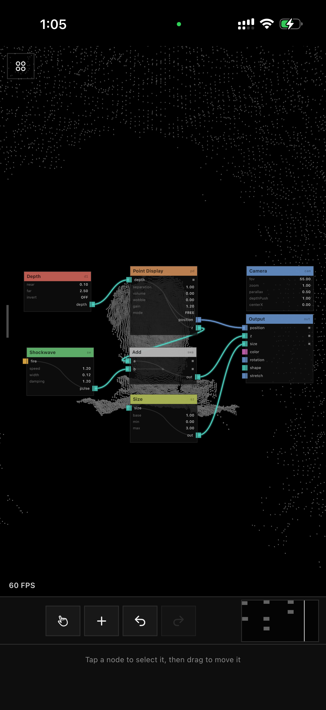

# Points — On-Device Test Guide (round 3, 2026-07-04)

Run the `Points` scheme on your iPhone. Report by number + ★ datapoints.

**Every Further/Node-View note from round 2 is addressed:**

- **Cleanup is now NODES (red FILTER family)**: Grazing Cull (slider, real GPU pass), Apple
  Depth Filter (bool node — and Apple's smoothing is now **OFF app-wide by default**), EMA
  Smooth, Fill Holes, plus Accumulate / Smooth Surface / Despeckle Voxel / Detail Upsample
  (registered, passthrough until their engine passes land). Insert between Depth and Point Display.
- **Fresh projects are MINIMAL**: Camera · Depth · Point Display · Size · Output. Nothing else.
  No preset effects anywhere.
- **The camera-view deck is CONTEXTUAL**: one slider page per node *in your graph* — a fresh
  project shows exactly those four pages; every node you add grows the deck. No orphan sliders.
- **Pads self-plumb**: first ❄ inserts a Freeze node in-line; first 💥 (or viewport tap) inserts
  Shockwave + an Add into the z feed — visible in the editor afterwards.
- **Node view rebuilt again** per your notes: 1-finger pan with inertia, pinch always wins,
  strip at the top of the bottom bar (tool · + · undo · redo centered, minimap ALWAYS on,
  4-circle menu back in the corner), bigger cards with internal flow glyphs, 2× port squares,
  full-screen palette with hold-a-row-to-add, straight/curved wire setting, camera POSITION jogs.
- Depth flat-cap fixed (near now 0.1 m), thermal palette reads hot-red at the closest points.

---

## 1. Fresh project + minimal graph

| # | Do | Expect |
|---|---|---|
| 1.1 | New project → swipe to node view | Exactly 5 nodes: Camera, Depth, Point Display, Size, Output — nothing else |
| 1.2 | Camera-view deck | Exactly 4 pages (CAMERA / DEPTH / POINT DISPLAY / SIZE), titled with node name + id above the sliders. Dots = 4 |
| 1.3 | Add any node with params (editor + → hold a row) | Deck grows a page for it; delete the node → page gone |
| 1.4 | Depth page | NEAR + FAR sliders — get close: face keeps coming forward smoothly, **no flat plateau** (near floor now 0.1 m) ★ confirm the "goes flat" bug is gone |

## 2. Cleanup FILTER nodes (red)

| # | Do | Expect |
|---|---|---|
| 2.1 | Fresh project, move to ~1.5 m+ | RAW depth: some fringe/flying pixels at silhouettes (Apple filtering is OFF by default — this is the honest sensor) |
| 2.2 | Palette → FILTER family | 8 red nodes: Grazing Cull · Apple Depth Filter · EMA Smooth · Fill Holes · Accumulate · Smooth Surface · Despeckle Voxel · Detail Upsample (last 4 say passthrough-for-now) |
| 2.3 | Add **Grazing Cull**, wire Depth.depth → its depth, its out → Point Display.depth | CULL slider eats silhouette fringes; works at ANY distance now (independent of Apple filter) — ★ compare vs TDLidar cleanup |
| 2.4 | Add **Apple Depth Filter** (just add it — presence = on) | Apple smoothing returns (smeary but hole-free). REMOVE the node → raw again |
| 2.5 | Add **EMA Smooth**, AMOUNT 0.3 | Static jitter dies, motion stays snappy (TDLidar temporal EMA) |
| 2.6 | Add **Fill Holes** | Dropouts persist instead of blinking |
| 2.7 | Stack: Depth → Grazing Cull → EMA Smooth → Point Display | ★ report the best-looking chain vs TDLidar |

## 3. Look + camera

| # | Do | Expect |
|---|---|---|
| 3.1 | ⬡ palette pad | Thermal by depth — **closest points RED-hot** (not white), far = dark, no wrap artifacts |
| 3.2 | Point Display card | ARMS param (OFF default — freestanding cloud). Menu stems-cube toggles it; ON = stems pull every point back to its Z pin |
| 3.3 | Camera node selected | TWO jog rows: **ORBIT** (angle around the cloud) and **POSITION** (slides the pivot itself, no re-centering) + scope resets per-row |
| 3.4 | ❄ then 💥 on a fresh project | Both work — enter the editor after: Freeze / Shockwave+Add nodes appeared in-line (self-plumbed) |

## 4. NODE VIEW — new gestures

| # | Do | Expect |
|---|---|---|
| 4.1 | 1-finger drag on empty canvas | **Pans** any direction. Flick → glides with inertia; tap anywhere → stops dead |
| 4.2 | 2-finger drag | Nothing (only pinch uses two fingers now) |
| 4.3 | Pinch anywhere — even with a finger over a wire | **Always zooms** (wire drags are dropped the moment a pinch starts); zoom is centered between your fingers; wires track in realtime |
| 4.4 | Hold a wire end with one finger, swipe empty space with another | View pans; the held wire END stays glued to your first finger and its port |
| 4.5 | Hold-drag a node to any screen edge | Canvas **auto-scrolls** under it (TouchDesigner style) — keep dragging into fresh space |
| 4.6 | Cursor tool armed → 1-finger drag on empty | Rubber-band select (pan is hand-tool only) |
| 4.7 | Minimap (bottom strip, right) | ALWAYS visible: nodes + white viewport window live-track pans/zooms/drags |

## 5. NODE VIEW — chrome + cards

| # | Do | Expect |
|---|---|---|
| 5.1 | Bottom bar in node view | **Strip on top**: hand/cursor · + · undo · redo centered, minimap right — filling the old dead gap; below it the selected node's settings; bar height follows param count |
| 5.2 | Top-left corner | The **4-circle menu is back** in the node view too |
| 5.3 | No selection | Just the hint line — the stray square+dash header is gone |
| 5.4 | Look at cards | Bigger (168 wide), text +2pt, port squares **2× and proud of the edge** |
| 5.5 | Add node card | Faint internal picture behind the values: two input lines meeting at a **+** then flowing to the output. Divide shows ÷, Mix shows mix, generic = ƒ. 1-in/1-out nodes = single line; sources = none |
| 5.6 | Settings → "Node wires" | STRAIGHT ↔ CURVED switches the whole canvas live |
| 5.7 | + → palette | **Full screen, square corners.** Tap a row = details; **hold a row 1 s** (it fills white) = instant add + close, node lands mid-canvas selected — no extra ADD tap needed (card ADD still works too) |

## 6. Regression sweep

| # | Check |
|---|---|
| 6.1 | FREE/PINOUT segments still on Point Display; FOCUS slider still shifts the stay-put plane |
| 6.2 | Undo/redo covers: adds, removes, moves, rewires, slider gestures, pad self-plumbing |
| 6.3 | Camera flip ×5 clean; RGB 1:1 (no squash); fps chip visible |
| 6.4 | 30k ★fps / 307k ★fps; 5-min soak warm-not-hot |
| 6.5 | Tutorial unchanged (SF symbols, 4-circle icon) |

---

## Known limitations (don't report)

- Accumulate / Smooth Surface / Despeckle / Detail Upsample are passthrough placeholders (their
  GPU passes are a later phase) — wiring them works, they just don't change pixels yet.
- Apple Depth Filter is front-camera only (ARKit LiDAR has no such toggle) and applies by node
  PRESENCE; its card shows ENABLED but there's no bool toggle row in the bar yet (remove the
  node to disable).
- FILTER nodes other than Grazing Cull act by presence — the depth wire passes through them
  untouched (the EMA runs before unprojection, at capture level, like TDLidar).
- Palette hold-add drops the node at canvas centre (a closing full-screen cover can't hand its
  touch to the canvas).
- Node resize is still pinch-over-selected-node.
- Pad self-plumb inserts use fixed ids (fz/sw/swa); pads are otherwise not undo-tracked.

## Report format

`1.4 flat-cap: <gone/still>` · `2.3/2.7: <cleanup vs TDLidar>` · `4.x` gesture fails by number ·
`6.4 = X / X fps` · anything else by number.

## Node view notes:
- the single touch movement controls are not consistant sometimes it works other times it doesnt, and and drag anywhere and it should work. - When you single swipe on a node or wire without holding it should do the single swipe move, I think thats where the single swipe movements are getting eaten when you tapswipe on a node
- When you tap and hold a node - it moves it to below the inside of the screen area down before you start moving it around. It selects the node and then instantly moves it to below the screen area - A symptom of adding the node move to edges to move nodeview area, It should only do that when you move the node to the very edges of the viewarea, Not when you pickup a node that is slightly offcenter in any direction. - currently it moves all the nodes down.

- In the creation list - Tapping add button no longer closes the list and adds the selected node, Only the tap and hold, Both should add the node and close the bar, The tap and hold should take 0.55ms and when it closes the listview it has the node selected and ready for movement with the white gradient edge so its ready for movement. 

- to select a wire you need to tap and hold on the output/input box for half a second and then it will start a dashed wire, Currently the action is too sensitive to accidental taps, Needs to be more deliberate.

- The bottom node bar now has the empty area at the bottom, Make the bottom bar sized so that the node options are at the bottom just above the homescreen area gap - and then the node tools bar is just above that. And resize the bar when a different node with more node options is selected to make it taller or shorter, So theres never a gap area and it gets sized according to what it needs to fit. The same should be true for the bottom bar in cameraview area - Now there is a emptyspace at the top, - Because we no longer need to fit into the 3:4 view exacly - Make that area just cover more of the camera are without distrupting the 1:1 output scaling. 

- when you leave nodeview then return to it it should always recenter. Also add a line on the right side of the camera view and the left side of the node view to indicate thats where you should swipe to change modes. Tapping on the line should also work to switch modes. 

- when you have a wire selected in white then tap the + button to add a node, As long as that node is compatible place it as the input and output for the new node - Basically like how the insert operator left click on wire in touchdesigner option works. 

- Inside the creation mode list, When you tap on a node in the list it brings up the details below it. There is a huge gap between the bottom safe area and where the text starts, And it covers half the screen even when the node has like 1 parameter, - like the nodebar vertical sizing - Size the node selection details bar according to what it needs to fit with the empty area not used removed and placed at the bottom just above the home button switcher safe area. 

- Add another option to the Node wires in settings that is "straight lines" which makes the wires that only necessary right angle turns and keeps the wires straight up 90 or straight down 90 or perfectly horizontal.

-When you tap the top 4 circle button in the top left - if you tap elsewhere it closes the horizontal accordian as if you tapped the button again to close it. 

- In the minimap on the right side alligned node bar tools area - When you tap on a place in the minibar the viewer jumps to that area immediately. 

Node settings:

The accumulate node slider doesnt seem to do anything to the output - I cant see the accumulation like it exists in TDLidar point cloud cleanup mode - it doesnt function the same.

The grazing cull edge slider - I am not sure what this does I cannot see any change from its output. - Make sure it works. 

---

## Round-4 fixes (2026-07-04 PM) — every node-view note above addressed

Node view / gestures:
- **Pan anywhere.** A single-finger swipe now pans even when it starts on a node or wire —
  the pan was being eaten by the node's own gesture; now the node only *moves* on a hold-then-
  drag, and any moving swipe pans. Drag from anywhere works.
- **Hold-to-move no longer teleports.** Picking up a node grabbed at (0,0) and flung the node
  (and the whole selection) to the bottom of the screen. It now waits for the real finger
  position before grabbing, so the node stays put under your finger. Edge auto-scroll only
  triggers within 20 px of the very border, not on a slightly-off-centre pickup.
- **Wire-start is deliberate.** Pulling a new wire out of an input/output box now needs a
  ~0.45 s hold on the box (haptic when it arms) before the dashed wire appears — accidental
  taps no longer start wires.
- **Recenter on return.** Leaving and re-entering the node view always refits/recenters the graph.
- **Edge swipe handles.** A short vertical line sits on the RIGHT edge in camera view and the
  LEFT edge in node view; **tapping it switches modes** (swipe still works too).
- **Insert on wire.** Select a wire (white) → **+** → if the new node has a compatible in+out
  it splices in-line between the two ends (TouchDesigner insert-operator), placed on the wire.
- **Minimap jump.** Tap (or drag) anywhere on the bottom-strip minimap and the viewport jumps
  there immediately.
- **Corner menu closes on outside tap.** Tapping anywhere off the open 4-circle accordion closes it.

Bars / layout:
- **Node bar bottom-anchored, content-sized.** Tools strip sits just above the node's options,
  options just above the home-indicator gap; the bar height follows the selected node (no dead gap).
- **Camera view fills more.** The viewport is no longer pinned to an exact 3:4 box — it fills the
  space above a compact bar and the pin grid renders **1:1 (never stretched)**, centred with black
  above/below. Bar has no top gap.

Palette / settings:
- **ADD button works on tap** (adds + closes); holding a palette row now takes **0.55 s** (was 1 s)
  and lands the node selected, ready to move.
- **Node-detail sheet is content-sized** — a 1-param node no longer opens to half the screen.
- **Node wires** setting now cycles **CURVED → STRAIGHT → RIGHT ANGLE** (orthogonal H/V routing).

Node settings:
- **Grazing Cull** CULL slider now bites visibly (rejects surfaces angled >~30° off the view ray at 1.0).
- **Accumulate** is still a passthrough placeholder — real temporal-accumulate is a GPU history
  pass scheduled with the cleanup engine phase, not a UI change; wiring it works, pixels unchanged.

## Nodes:
  - When nodes have more than one input or output - its very difficult to select the one you want without zooming in a lot - Making it difficult to use. When you have a input or output square selected it should highlight it with the white outline, Slowly sliding the held finger up and down will change which output/input square is selected and change the white outline to match. The white outline should appear on the node wire square connection but doesnt have to appear on the entire node. 

  - When you select a node input/output box and it already has a wire connected it want to default to moving the existing wire. - The white outline should appear on the box & also remove the function where you hold the end of an existing connected wire to change it - To change an existing wires setup you first have to tap it to highlight it in white then drag on or the other end to rewire it - this will stop misclicks.

    - So to be clear to disconnect a wire from its connected node you first need to select it by tapping on it then tap on the wire closer to the connected node edge than its center which makes it turn into the checkered line and lets you drag it to its new node connection. 

  - the 1 finger node viewer area movement inconsistency also occurs when you start the swipe/drag action ontop of a nonselected wire, Make it so the the 1 finger swipe to move around action is not so can start or end on existing non-selected wires.

  - an exception to the 1 finger drag node viewer movement is when you have a wire or node selected, - In this case the node or wire should be what moves, And it should not require the node hold to move action it should just move as soon as you tap-swipe on an already selected node. So to move nodes you tap on them to highlight in white, Then tap again and swipe to the place you want it to move. When you have a node selected with the white outline and you tap it again then swipe the white gradient outline should instantly appear, not after a hold action 

  - the hold to drag movement on a node - Remove that, You must have the node you intended to move selected with the white outline then you can drag to move it. - Otherwise holding it does not bring up the white gradient. 

-   When a node is above a wire - you automatically select the node never the wire behind it. To move a wire you tap it to bring up the white outline, Then tap and drag on either end of it to disconnect it from a node. If you tap on the square node connection area that will only add a new wire from that node input or output - Never diconnect the existing wire. 

-  If you select a node output then drag to create a new wire, If you let go without connecting it to anything - It brings up the node creation screen and shows only compatible nodes that can be connected as inputs from that node you dragged it from. If you do the same with an input node it just makes a wire that you have to manually connect.

  - The node pinch to expand size is inconsistant - remove it completely.

  I want you to make the node, wire, and viewer movement all consistant so its not just what I randomly asked for - I believe the above has defined that but if theres any other movements I am not thinking of please add them or discuss with me via an AskUserQuestion to refine the specifics of the node traversal and creation functionlality - So the average touchscreen user can easily grasp and use the node networks as part of the app without having to read a manual or through trial and error. 

## Node Creation:

  - In the Node creation list when you tap on a node now it brings up a rounded corner on all sides box - With the black square area inside it being the only correct part - remove all of the rounded corners from its edges on all sides and fit the black square inside it to the bottom of the screen area just above the safe area for the home button close.   see screenshots of how it looks. remove the rounded corners, Leave a small gap for the home screen safetly area. And make the top edge of the details bar a straight line with no curves or edges. And all black like the square inside that rounded corner box.

  - In the node creation page - I want a button to the left of the close button - Which changes from 4 cubes to a list and displays the node groups like signal body time etc in a top bar that you swipe horizontally to choose between each group - and then select a group to display that group of nodes as little cubes with 3 horizontal rows of the nodes, Sort of like how touchdesigners Operator menu works with the top bar you select the node type, then inside that operator type you select the operator, I want the same tap and hold logic to close or tap to bring up the details at the bottom press add then it closes.

## Other Issues:

Changing the size of the pins creates the effect where they all flatten when you get past a certain distance, Like the pinout screen is unable to move them past a certain Z depth, there should be no limit/gate on how far Z forward the pins can go - For truedepth- when you get too close to the camera (not the case here still within safe distance) the Z information starts disapearing. Its only an issue when the pins are made to be above a certain size, not sure why.

the pins on the right side of the face that fall backwards from the depth - They appear infront of the face pins on the right side but not the left. 

Very important - See screenshot: 
There is a giant empty area that covers about half the screen I have drawn a square around it in red in the cameraview above the bottom bar areas, The bottom bar tools should stay exactly where they are - All you are doing is closing that empty space so the top of the bar (white 1px divider) is just above the sliders, So remove all that empty space and make the bottom bar shorter, The remaining empty space will be used for the cameraview. 

The Nodes catalog and functionality seems inconsitent - I cannot figure out how to for example connect a shape morph node which outputs a pin wire to the rest of the default network. I also cant figure out how to add the camera node to the network its output is orange and says cam - But it does go to other orange type wires. And further the node wire colors are inconsistant and dont always match their node output/input square colors. Like the Position and Z to output wires appear orange but their squares are blue and teal. Make the squares match the wire color. Or explain how the logic is supposed to work. Right now I cant figure it out so I think it must be not coded correctly but I could be totally wrong. 

The tutorial projects all launch to the same default project and dont actually have anything in them - Try make the tutorials actually real networks.

I am also unable to figure out how to connect the Body node group to the rest of the network - Help me understand how those kinds of nodes fit into the existing node setups, And further how we start creating more advanced networks that display the Z and specific parameters based on for example Audio Analysis sound input, or body node movements effecting the shapes of the pins, or other more advanced setups. I want maximum compatibility and usability for all the nodes and using them in effective ways to create unique visuals. - Or for example driving the pin shape change with audio analysis, Or driving pin shape change with specific hand gestures. Stuff like that. 

## Tutorial Notes (in no particular order but address all):
  In the tutorial - The Swipe left for node view -Instead of just having next buttons you should actually have to complete the action which transtions to the next page. 
  The four circles are the menu - The black overlay should fade for where the 4 circle menu bar is so its visible.
  Remove the first "this is a pin screen" - from the tutorial.
  The second tutorial page "Sliders Live at the bottom" - It should show the the sliders and the black overlay and the next & skip button should be above the bottom bar.
  "Swipe the bar for more pages" - You should have to complete this action which then automatically moves to the next page in the tutorial, Same with the "The square Pads are instant" tutorial page you tap on one of the square pads which should have the circle pulsing animation thing over it 
  remove the picture is touchable page from the tutorial

---

## Round-5 fixes (2026-07-04 late) — node model rebuilt + creation UI + render + tutorial

**One consistent node/wire/viewer model (all of the "Nodes:" notes):**
- **Tap = select** (node, or wire, or empty = deselect). A node above a wire always wins the tap.
- **A SELECTED node moves on drag — no hold.** Tap it white, then drag. Hold-to-drag removed.
- **Drag anything unselected (node, wire, empty) = PAN.** Pan no longer gets eaten by wires.
- **Pull a NEW wire:** press a port square, **slide up/down to pick the exact port** (white outline
  tracks the choice), drag out. Never grabs an existing wire → no misclicks.
- **Re-route a wire:** tap it white first, then drag either **end**. Tapping a port only ever ADDS.
- **Drop a new output-wire on empty →** node creation opens **filtered to compatible inputs** and
  auto-connects. (Input-wire dropped on empty just cancels — land it on a port.)
- **Pinch-to-resize a node: removed** (pinch always zooms).
- Wire colour now **matches the port square** (coloured by port TYPE, not node family).

**Node creation:**
- Detail panel: **square corners, flat black, straight top edge**, sized to content, above the home gap.
- New **grid mode** (toggle left of ✕): swipeable family bar (SIGNAL / BODY / TIME…) over a 3-row cube
  grid — TouchDesigner OP-menu style. Tap = details, hold 0.55 s = add. List mode still there.

**Camera / connectivity:** Camera is a **global Stage node** — the misleading orange `cam` port is gone;
never wired, just edit its sliders. Full "how do body / audio / camera nodes fit + recipes" write-up:
`Plans/PRIMER-Node-System.md`.

**Render:**
- **Forward-Z gate removed** — pins no longer plateau/flatten past a distance; closer = pushes further.
  (Big pins merging into a wall is sphere overlap, not a gate — shrink SIZE or raise separation.)
- Camera-view **dead space gone**: exact 3:4 grid, nothing between the pins and the bar; slack sits
  under the Dynamic Island; bar is short/content-sized.
- Right-side-of-face pins in front on one side only: needs an on-device look — report if it persists.

**Tutorial:** removed the "pin screen" + "picture is touchable" pages; dim covers only the picture (bar
stays live, Next/Skip above it); swipe-bar / tap-pad / swipe-to-nodes actually **gate** the advance;
menu step cuts a hole so the real 4-circle menu shows.

**Templates:** the 5 browser templates load **distinct real graphs** (Comet Trails = Trail on Z, Arm
Fire = stems + fire palette, Beat Strobe = 8 Hz LFO → Size, Kick Shatter = depth-driven Scatter).

## Round 5 notes:

The node creation touchdesigner style mode, Should have 3 across fitted to the horizontal edges then scroll vertically down - So the top bar area remains a horizontal scroll, but the actual nodes themselves are 3 across fitted to the edges, and scroll down in rows of 3. that way the touchdesigner style node creation picker covers the whole screen area list the list view and doesnt shrink like it currently does.  In the list style node creation page - The detail bar doesnt go to the bottom of the screen so you can see other text from the list in the gap between the home button gap  see red squares, There is also a gap on either side but its quite faint - Make the box go to the bottom edges of the screen and side edges.

The Top of the node viewer area has a gap at the top of the screen that the cameraview doesnt - Which also gets larger sometimes and is only fixed by clicking on a node to raise the bottom bars size - deselecting the node makes the top area gap return. Remove it alltogether so the cameraview and the nodeview tops are the same.  remove the red area.

The wire movement is a difficult thing to do - Make it so that when you have a wire selected tapping and dragging it from anywhere except its midpoint grabs either one or the other end of the wire for rewiring. You still have to tap first to highlight it or "select" it. Then you move  

For the Depth Gradient node and probably some others - only the first 4 sliders appear in the bottom bar area and the farG gets cut off. Shouldnt the depthgradient also have a farB as well? - fix that.

The cameraview bottom bar still has a gap between the sliders and the top of it. See screenshot red box area. remove that as well

The Hand Gesture node should have a point output, Not a pinch output there is no pinch hand gesture recognition.. as far as I know its palm, fist, Peace and Point - those should be the hand gesture node outputs. The Hand Gesture fire doesnt seem to work when I wired it up to shockwave wire input it doesnt fire a shockwave that I can see. 

There should be a bigger safe area between the bottom node settings and the home button safe area - The bottom rounded corners of iPhones displays should be the safe blank area,   see bottom area - Make it 5-8px larger so theres a safe gap between the lowest setting and the area where you swipe to go home. 

The hand pinch should be its own node which determines the distance between the index finger end point and thumb finger end point for whatever hand is there first. - which is calculated in a number that gets output every time it changes, Use this to drive things like the Z depth change with a pinch for example.

When you have a wire selected a remove icon should appear in the bottom bar so you can select then delete wires if you want. 

Due to apple depth filtering being disabled I think there is a black shadow on the right side of the face and other object, which creates this trail like effect. Figure out how TDLidar Lidar mode fixed the black shadow area without enabling apple depth filtering and apply that fix here.  the same thing happened in tdlidar lidar face mode - And we found a fix for it that kept apple depth filtering disabled by default. Figure out how they fixed it and apply the same. 

---

## Round-7 fixes (2026-07-04 night) — your Round-5 notes + node audit

- **Grid palette:** now 3 cubes across, fitted to the screen width, scrolling DOWN in rows of 3 (was squashed in the centre).
- **Node detail panel:** no longer a system sheet — a flat black panel that reaches the bottom + side edges of the screen (no list peeking through, no faint side gaps).
- **Node view top gap:** gone — the editor is pannable so it FILLS the whole area above the bar (only the camera view keeps the exact-3:4 picture). It no longer grows/shrinks when you select/deselect a node.
- **Camera deck gap** (between picture and sliders): gone — a greedy Spacer in the deck was the cause.
- **All sliders show:** the node settings bar was capped at 4 sliders (Depth Gradient farG/farB were cut off — it always had farB). Now shows every float param.
- **Wire rewire:** with a wire selected, dragging it ANYWHERE except the midpoint grabs the nearer end to rewire (tap to select first).
- **Delete a wire:** select a wire → a WIRE bar with a DELETE (trash) button appears in the bottom bar.
- **Extra home-swipe gap:** +6 px below the lowest setting.
- **Hand Gesture** now outputs palm · fist · peace · point (not pinch). **Hand Pinch** is its own node (index-tip↔thumb-tip distance). *(Both read 0 until the Vision engine lands — that is why the gesture did not fire a shockwave yet.)*

**Depth shadow / trail (IMG_8817):** ported TDLidar’s `cleanupFillHoles` — each invalid pixel (the front IR projector shadow) is filled with the inverse-distance-weighted average of its valid neighbors, BEFORE the temporal EMA. Runs by default (radius 3), Apple filtering stays OFF. Kills the black band and the persist trail. ★ confirm the shadow is gone.

**Audio is LIVE** (see `Plans/NODE-AUDIT.md`): Audio Levels / Mic Level / Beat Trigger / Burst run off a real mic FFT. Add Audio Levels, wire bass → Size, clap. Remaining placeholders (Vision body/hands, render shapes, MIDI, OSC) each need one named subsystem — audit doc lists them.

6 session notes:

the default value for the pinout point display should be
Seperation 0.50
volume 0.00
wobble 0.00
gain 0.34
focus 1.00
gamma 1.00
zflatten 1.00
and for the pinout the camera defaults should be 
FOV 15.00
Zoom 2.00
parallax 1.0
depthpush 3.0
centerx 0.00
centery 0.00
orbitx 0.00
orbity 0.00

the free defaults should stay the same. Only change to those values when you use pinout 

now the top area of the cameraview has a dead space area. Fit the viewer area into the size between top of the screen area (below the dynamic island) and the bottom bar, It doesnt have to be 3:4 only the actual render needs to be 3:4 since the camera isnt bound to the render area anymore it can be any size. 

## Round 7 Notes:

### Part 1, Do these first:
the shockwave effect gets inadvertently triggered by you opening or tapping on any of the top left bar settings - make the area aorund the top bar free from touch based triggers, Make it like a safe area when the bar constantly in that top left corner - and trigger the safety to expand when you have the menu open so tapping a option in the top

Tutorial:
The square bpads are instant - the circle animation trigger thing should be removed, Its not in the right place - Instead place a white highlight gradient around the row of square pad buttons so its obvious what you need to press to proceed - When you tap one the gradient fades away

Swipe left for node view. - Hightlight the gradient on the right edge that switches to the node view in a white gradient that fades when you do the swipe action. also remove the dark transparent overlay on the screen in just that area. 

Four circles are the menu - remove the dark transparent overlay on the screen in just that so its obvious which button it is. 

In the cameraview bottom bar - When a node like the camera node has buttons in its node settings, replace the pads with the buttons from that node - For the camera node its the orbit & move camera UDLR and recenter buttons - However there are too many for that - So instead make the pad becoma a micro joystick, The first button pad selects orbit or move - the second button pad is a micro joystick that you tap and swipe or tap and hold in the cardinal direction you want it to move updownleftorright. the third button is a recenter button pad which should be like the shockwave - a onetime trigger. 

When you do the tutorial - A add and shockwave appear in the node network and are connected to it. One thing is that the add and shockwave nodes appear ontop of other nodes, This shouldnt be possible nodes cant be ontop of other nodes more than a small amount allowed for placement of new nodes in jumpled areas. Further when a node is above another nodes input/output squares default to selecting the node. the default node positions in the default file with the shockwave should look like this: 

One other thing about node selection - if you have nothing selected in node view and you tap and hold on a node you dont need to release it - it gets selected and then you can move it straight away with one tap hold drag motion, but you have to hold for half a second to trigger this otherwise the app will just see it as one finger movement. 

Within the cameraview - When you double tap on the name of the slider tab you have open = for example camera - double tapping on the top centered name transitions you to the node view - And selects that node, in this case camera. 

Sometimes if you are moving a node or wire near the left edge of the screen it triggers the return to the cameraview. So to avoid complications or confusion - Remove the swipe from left/right edge functionality - and leave only the tap the edge bar as the method for moving between the views, For both cameraview and nodeview

Like how when you pull create a wire from an output and it opens the node creation screen with compatible nodes, Do the same for the input so I can see whats working and what isnt - Make this an option in the app settings, "new node from input, output" as square like switches that you enable/disable by tapping on them to enable/disable them. Dont use the apple switches thats SUPER lazy, Fit the switchs off on within the style we already have in the app, White black text means on, black white text means off. 

### Part 1.5

please start work on the next round of nodes that are properly built instead of placeholders. @Plans/NODE-AUDIT.md  do the midi so I can test it using touchdesigner midi out. Also setup the NDI properly - And use the same method that the ZPTH app uses so that there arent warning (embed the NDI library in the app which supresses the warning.) NDI should be a node that you connect to the end of the Output node - which lets you set its resolution, orientation 3:4 or 4:3 output, alpha masking of the background, FPS rate, the NDI stream name, NDI wired mode (see tdlidar codebase for guidance on that) When you hit the NDI button inside the top bar options it creates the NDI node and automatically hooks it up to the output of the output node. The same should be true for the recording node with similar options that are relevant to its recording functionality, basically all the same options the FPS, Resolution, orientation 3:4 or 4:3 output, alpha masking of the background /ios-networking /axiom-ios-performance Use sosumimcp for apple documentation guidance /sosumi   

/Users/ari/Documents/XcodeProjects/Points/Points/CameraSources.swift
/Users/ari/Documents/XcodeProjects/Points/Points/CameraSources.swift:19:13 Capture of 'self' with non-Sendable type 'TrueDepthCamera' in a '@Sendable' closure

/Users/ari/Documents/XcodeProjects/Points/Points/CameraSources.swift:26:16 Capture of 'self' with non-Sendable type 'TrueDepthCamera' in a '@Sendable' closure

/Users/ari/Documents/XcodeProjects/Points/Points/CameraSources.swift:33:33 Capture of 'self' with non-Sendable type 'TrueDepthCamera' in a '@Sendable' closure

/Users/ari/Documents/XcodeProjects/Points/Points/ContentView.swift
/Users/ari/Documents/XcodeProjects/Points/Points/ContentView.swift:194:44 Call to main actor-isolated instance method 'current()' in a synchronous nonisolated context

/Users/ari/Documents/XcodeProjects/Points/Points/ContentView.swift:197:44 Call to main actor-isolated instance method 'current()' in a synchronous nonisolated context

/Users/ari/Documents/XcodeProjects/Points/Points/PinRenderer.swift
/Users/ari/Documents/XcodeProjects/Points/Points/PinRenderer.swift:345:20 Call to main actor-isolated global function 'perspective(fovY:aspect:near:far:)' in a synchronous nonisolated context

/Users/ari/Documents/XcodeProjects/Points/Points/PinRenderer.swift:351:23 Call to main actor-isolated global function 'lookAt(eye:center:up:)' in a synchronous nonisolated context

/Users/ari/Documents/XcodeProjects/Points/Points/PinRenderer.swift:395:30 Call to main actor-isolated static method 'generate()' in a synchronous nonisolated context

These are warnings that appear in the build - Go through them and justify or remove them based on /swift-best-practices   

### Part 2, Do these after part 1 and stop to justify the changes. Then do the AskUserQuestion 10 rounds, but check the skills first to ensure you are asking the right questions, Not so much aboout the UI, more q's about the functionality of the trigger as part of the app as a live Visual Sytnth.

The hand gesture outputs only to the shockwave node - Thats not what I asked for - every type of trigger node or output should be compatible with everything. You took my instruction in round 5 literally and only added the trigger on shockwave, Redo all the body nodes so they can trigger anything, Color mix for example. Anything with a trigger output. I want deep and detailed trigger logic for every single existing node. Stuff like color gradient node that uses sliders. - can have triggers that change the color based on midi, osc, hand gesture body movement, hand positions. Literally anything and everything. and not just for color gradient node for every single node with sliders, You program actions using a third view to the right of the node view with its own edge bar thing to open it. Which lets you edit the functionality and triggers of a selected node - In a view called triggersview. This lets you set actions to trigger on timings, set the change values in the sliders, Control how the change happens (gradual, immediate, what kind of curve the change has like cubic, bounce, quadratic etc). Each and every node should have a trigger input square - and every node can accept multiple triggers as many as you desire to program. We oill use a visual programming style and logic that lets you create the trigger responces in the trigger views, Add if this then that logic with what will be "trigger nodes" nodes that dont appear within the base node creation area but are specific to the triggerview. When you select a node in nodeview then tap the right side edge view - it displays that node and its sliders with a bottom bar where you create the logic, Timings, ifthisthenthat logic, set the transition logic like qudratic,cubic,bounce etc. You set the values that the sliders should move between using a timeline bar that appears in the space where the + undo redo minimap exists in nodeview. AskUserQuestion about this functionality 10 rounds so I can be sure you get it right, But read the /ios-design /mobile-design /audio-expert and other relevant skills to achieve this task. 

### Part 3, do this last after I have tested and confirmed the trigger view.

There should be complete customization to those cameraview bottom bar pads, So you can select what they do permantly not just the ones set there - In the space between the right edge of the last pad - add a small edit cog button which lets you fully customize and set them like you would in an apple or chrom top bar - Where you have the 6 pads that are there and then every different option available to you, You drag the buttons into place or over an existing pad in the area to replace it with the one you selected. - Part of this feature is going through every single node and making sure that each of them thats relevant has a pad for it. 