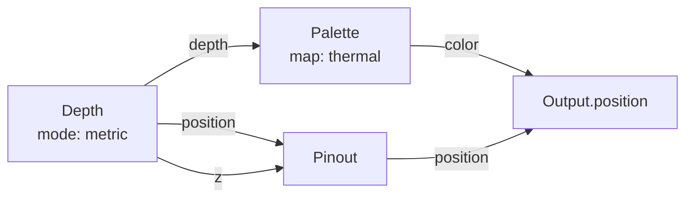
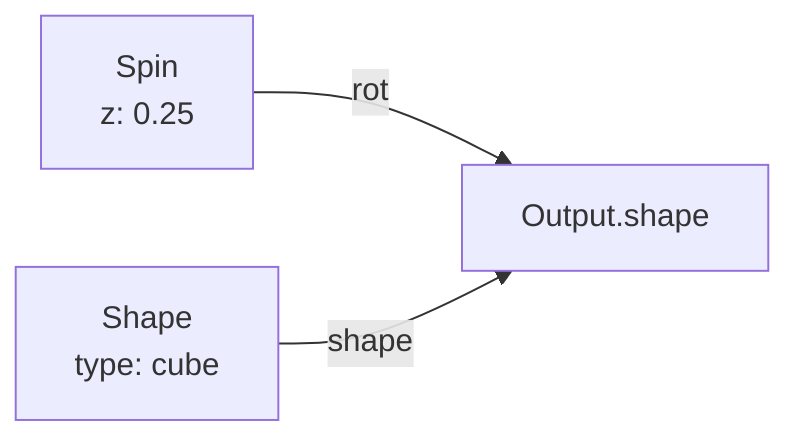
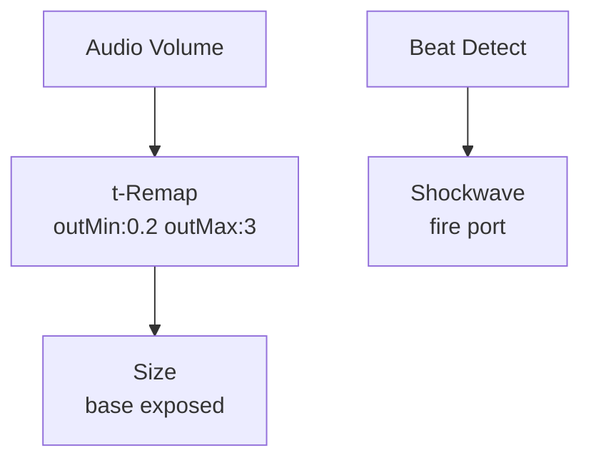

# Getting Started

## The Interface

Points has three zones:

| Zone | Location | Purpose |
|------|----------|---------|
| **Viewport** | Top 75% | Live 3D point cloud — 200,000 points at 60fps via Metal |
| **Nodeview** | Bottom bar | Drag nodes from the palette, wire them together on the canvas |
| **Cameraview** | Bottom bar | Sliders, pads, and buttons for the selected node or global controls |

### Navigating the Nodeview

The **Nodeview** is the bottom bar where you build your patch:

1. Tap the **+** button to open the node palette — nodes are organized by family (SOURCE, GRID, FILTER, etc.)
2. Tap a node to add it to the canvas
3. Drag from an output port (right side) to an input port (left side) to wire nodes together
4. Tap any node to select it — its parameters appear in the Cameraview
5. Long-press a node to delete or duplicate it

### Navigating the Cameraview

The **Cameraview** shows controls for the currently selected node:

- **Sliders** — Adjust float parameters in real time. Changes apply instantly to the GPU pipeline
- **Option pickers** — Switch between modes (metric/free, thermal/viridis, etc.)
- **Toggle buttons** — Boolean on/off params
- **Expose** — Tap the expose icon on any slider to create an input port on the node, letting you wire a signal into it

### Global Controls

The Cameraview also has global pads:

- **BPM** — Global beats-per-minute for clock-synced nodes
- **Color Mode** — none / video / palette override
- **Strobe** — Global strobe toggle
- **Invert** — Global color invert

## Node Structure

Every node follows the same structure:

```
┌─────────────────────────┐
│  NODE NAME              │  ← family badge + name
│  ─────────────────────  │
│  [param controls]       │  ← toggles/sliders/pickers
│                         │
│  ○ input1    output1 ○  │  ← ports (left = input, right = output)
│  ○ input2    output2 ○  │
└─────────────────────────┘
```

A node spec defines:
- **ID** — Unique string key (e.g. `depth`, `palette`, `spin`)
- **Family** — Category (SOURCE, GRID, FILTER, SHAPE, MOVE, COLOR, SIGNAL, BODY, TIME, STAGE, OUTPUT)
- **Inputs/Outputs** — Typed ports that accept specific data types
- **Params** — Float, bool, or option parameters with ranges
- **Execution** — GPU (per-pin, field-rate) or CPU (control-rate)

### Port Types

| Type | Description | Direction |
|------|-------------|-----------|
| `fieldFloat` | Per-pin float (GPU) | GPU nodes |
| `fieldVec3` | Per-pin vec3 (GPU) | GPU nodes |
| `fieldColor` | Per-pin RGBA (GPU) | GPU nodes |
| `signal` | Single float per frame (CPU) | Control nodes |
| `trigger` | Event pulse (CPU) | Control nodes |
| `vec3` | Single vec3 per frame (CPU) | Control nodes |
| `color` | Single RGBA per frame (CPU) | Control nodes |
| `domain` | Pin-set handle | Grid nodes |
| `source` | Depth+color stream bundle | Source node |

### Auto-Adapt

Ports auto-convert when wired:
- `signal` → `fieldFloat` (broadcasts to every pin)
- `vec3` → `color` and vice versa
- `fieldFloat` → `fieldVec3` (splats to all channels)

## Your First Patch

Build a thermal-colored LiDAR point cloud in 4 steps:

1. **Add Depth** — Source family. Reads the camera and produces per-point depth data
2. **Add Pinout** — Grid family. Snaps points to grid, pushes Z by depth
3. **Add Palette** — Color family. Maps depth 0–1 through a color gradient
4. **Add Output** — Always present. Wire everything into it



### Adding Modulation

Drop in a **Spin** node (Shape family) to rotate continuously:



### Adding Audio Reactivity

Expose a param on any node, then wire audio into it:



## Wiring Rules

- One wire per input port — use Mix or Add to combine signals
- Expose any slider to create an input port
- GPU nodes run per-point; CPU (trigger) nodes run once per frame
- The Output node is always present — everything routes through it
