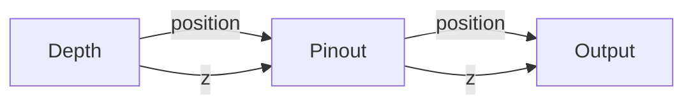
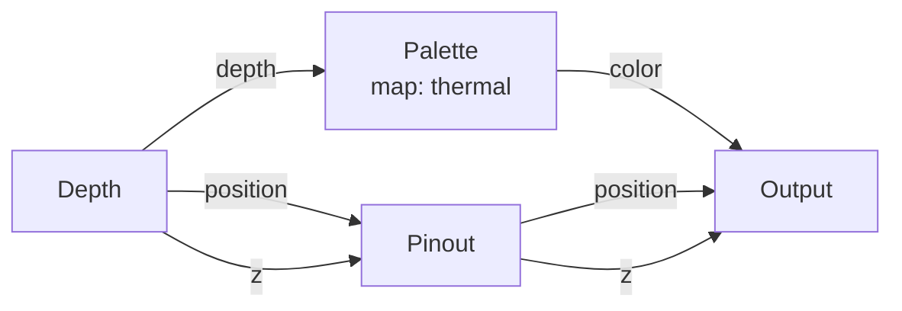
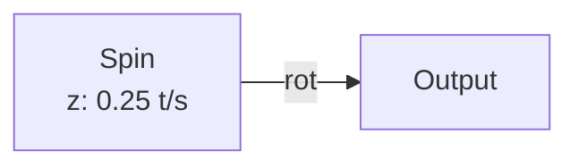

# Getting Started with Points

{: .no_toc }

Points is a visual synthesizer — you build patches by wiring nodes together in a graph. Each node does one thing (read depth, apply a color palette, spin points), and wires carry data between them. The result is a real-time Metal-rendered point cloud.

## Table of contents
{: .text-delta }
- TOC
{:toc}

---

## The Canvas

When you open the app, you land on the **Browser** — pick a template or start blank. After that, you're on the **Stage**:

| Zone | What It Is |
|------|-----------|
| **Viewport** (top ¾) | The live 3D point cloud. 200,000 points rendered at 60fps via Metal. |
| **Nodebar** (bottom bar) | Drag nodes from the palette onto the canvas. Each node is a card you wire together. |
| **Camerabar** (control bar) | Sliders, pads, and buttons for the current selection. Param sliders update in real time. |

## Your First Patch

Let's build the simplest possible patch — depth → pinout → output:

1. **Add a Depth node** — This is your sensor. It reads the LiDAR/TrueDepth/RGB camera and turns it into per-point depth data.
2. **Add a Pinout node** — This snaps every point to its home grid position and pushes Z by the depth value. Think of it like a pin-screen toy.
3. **Add Output** — This sends the final position, size, and color to the renderer. Without it, nothing draws.
4. **Wire them up**:
   - Depth `position` → Pinout `position`
   - Depth `z` → Pinout `z`
   - Pinout `position` → Output `position`
   - Pinout `z` → Output `z`

{: .note }
The Output node is always present — it's the final sink. Everything must route through it to appear on screen.

## Adding Color

Now let's make it colorful. Add a **Palette** node between Depth and Output:

The Palette node maps the 0–1 depth value through a color gradient (thermal, viridis, plasma, etc.). Wire `palette.color → Output.color`.

## Adding Motion

Drop in a **Spin** node to make points rotate continuously:

Set Z to 0.25 turns/second. Wire `spin.rot → Output.rotation`. Switch the Shape from sphere to cube to see the spin visibly.

## Wiring Rules

- **One wire per input port** — An input can only receive from one output. Use a Mix or Add node to combine signals.
- **Auto-adapt** — You can wire a `signal` into a `fieldFloat` port (it broadcasts to every pin). `vec3 ↔ color` auto-converts.
- **Exposed params** — Any slider on a node can be "exposed" as an input port. Wire a Time, LFO, or Hand Position node into it for live modulation.
- **Trigger layer** — Control-rate nodes (If/Then, Envelope, Spring, Threshold) run on the CPU. Wire them into exposed params to create reactive behaviors.

## Naming Conventions

Throughout the app and docs:

| Term | Means |
|------|-------|
| Points / dots / circles / spheres | All the same — point cloud points |
| Nodebar | The bottom bar with the node browser |
| Camerabar | The bottom bar with sliders, pads, buttons |
| Pin | One point in the pin-screen grid |

## Next Steps

- Browse the [node reference](/nodes/) for every node's parameters and examples
- Read the [integrations guide](/integrations) for MIDI, OSC, and NDI setup
- Learn about [trigger nodes](/nodes/signal#trigger-nodes) for reactive behaviors
