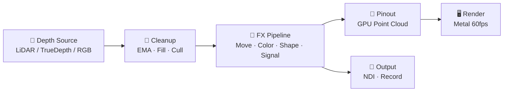
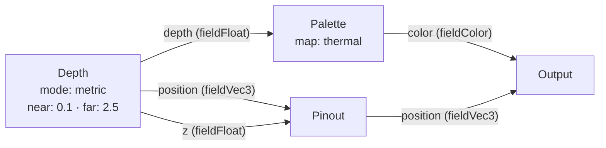

<canvas id="bg-canvas" style="position:fixed;top:0;left:0;width:100%;height:100%;z-index:-1;opacity:0.35;"></canvas>

# Points — Visual LiDAR Synthesizer

{: .fs-9 }
A live point cloud instrument with 110+ GPU nodes. Wire them together, modulate with audio/MIDI/OSC/gestures, and create real-time Metal-rendered visuals from LiDAR, TrueDepth, or RGB camera sources.

{: .fs-6 .fw-300 }
[Get Started](/getting-started){: .btn .btn-primary .fs-5 .mb-4 .mb-md-0 .mr-2 }
[Node Reference](/nodes/){: .btn .fs-5 .mb-4 .mb-md-0 }
[Integrations](/integrations){: .btn .btn-green .fs-5 .mb-4 .mb-md-0 }

---

## How Points Works

Points never leave the GPU. The renderer fetches directly from the unprojector's interleaved 24-byte buffer — no CPU readback, no frame drops at 200,000 points.

## Three Camera Modes

| Mode | Sensor | FPS | Character |
|------|--------|-----|-----------|
| **CLOUD** | Back LiDAR (`.sceneDepth`) | 30 | True 3D metric depth, 1:1 with reality |
| **FACE** | Front TrueDepth | 30 | Face mesh + 52 blendshapes as mod sources |
| **LUMEN** | Back RGB (luma-as-depth) | 60 | Flatter, grid-stable, unlocks per-pin history FX |

## Node Families

### 🎥 Source
[Depth](/nodes/source#depth) · [Video Color](/nodes/source#video-color) · [Vision Model](/nodes/source#vision-model) · [Proximity](/nodes/source#proximity)

### 📐 Grid
[Grid Info](/nodes/grid) · [Pinout](/nodes/grid#pinout) · [Domain](/nodes/grid#domain) · [Jitter](/nodes/grid#jitter) · [Regions](/nodes/grid#regions)

### 🧹 Filter
[EMA Smooth](/nodes/filter#ema-smooth) · [Fill Holes](/nodes/filter#fill-holes) · [Grazing Cull](/nodes/filter#grazing-cull) · [Accumulate](/nodes/filter#accumulate)

### 🔷 Shape
[Size](/nodes/shape) · [Shape](/nodes/shape#shape) · [Stretch](/nodes/shape#stretch) · [Spin](/nodes/shape#spin) · [Look At](/nodes/shape#look-at)

### ➡ Move
[Depth Drive](/nodes/move) · [Lag](/nodes/move#lag) · [Trail](/nodes/move#trail) · [Ripple](/nodes/move#ripple) · [Shockwave](/nodes/move#shockwave)

### 🎨 Color
[Palette](/nodes/color) · [Duotone](/nodes/color#duotone) · [Contrast](/nodes/color#contrast) · [Depth Fog](/nodes/color#depth-fog)

### 〰 Signal
[Math](/nodes/signal) · [Noise](/nodes/signal#noise) · [Sine](/nodes/signal#sine) · [Remap](/nodes/signal#remap)

### 🧠 Trigger
[If/Then](/nodes/signal#trigger-nodes) · [Envelope](/nodes/signal#trigger-nodes) · [Curve](/nodes/signal#trigger-nodes) · [Spring](/nodes/signal#trigger-nodes)

### 🤖 Body
[Hand Position](/nodes/body) · [Pinch](/nodes/body#pinch) · [Gestures](/nodes/body#gestures) · [Head Pose](/nodes/body#head-pose)

## Quick Example: Depth → Palette → Output

A minimal patch that turns your LiDAR depth map into a colored thermal cloud:

