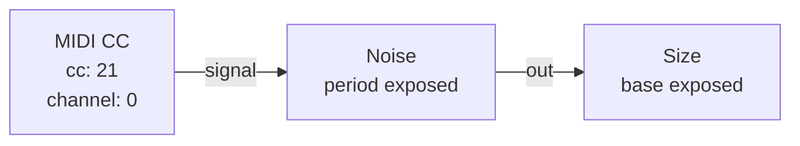
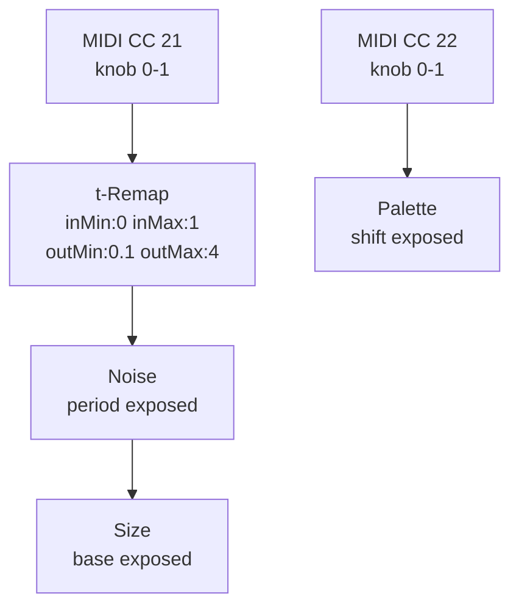
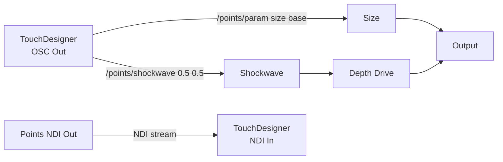
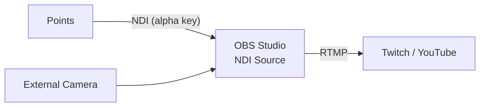
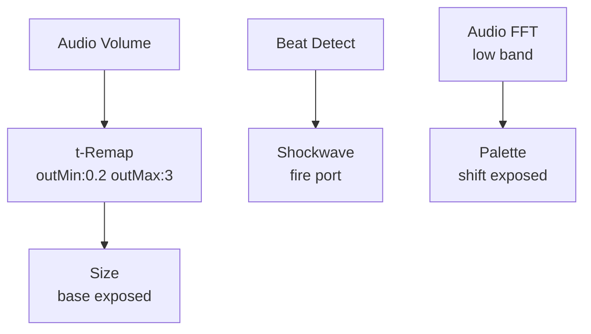
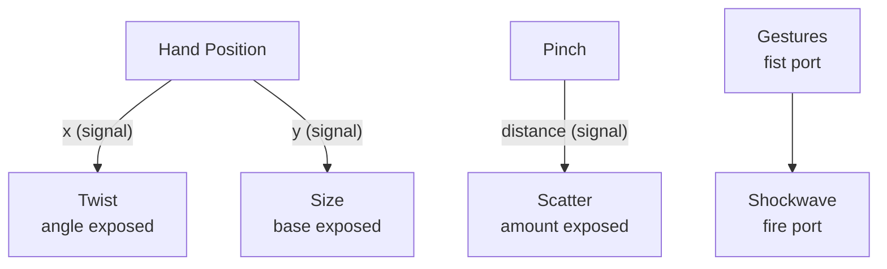
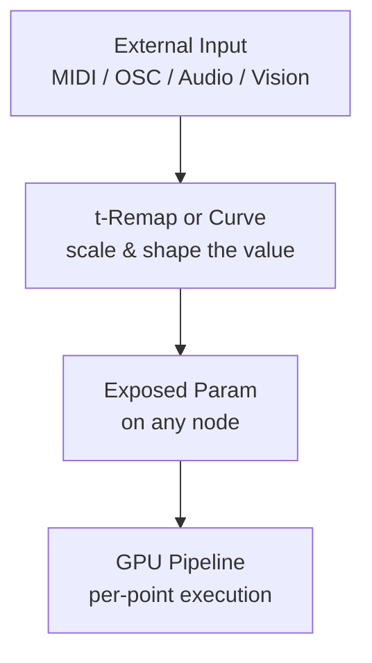
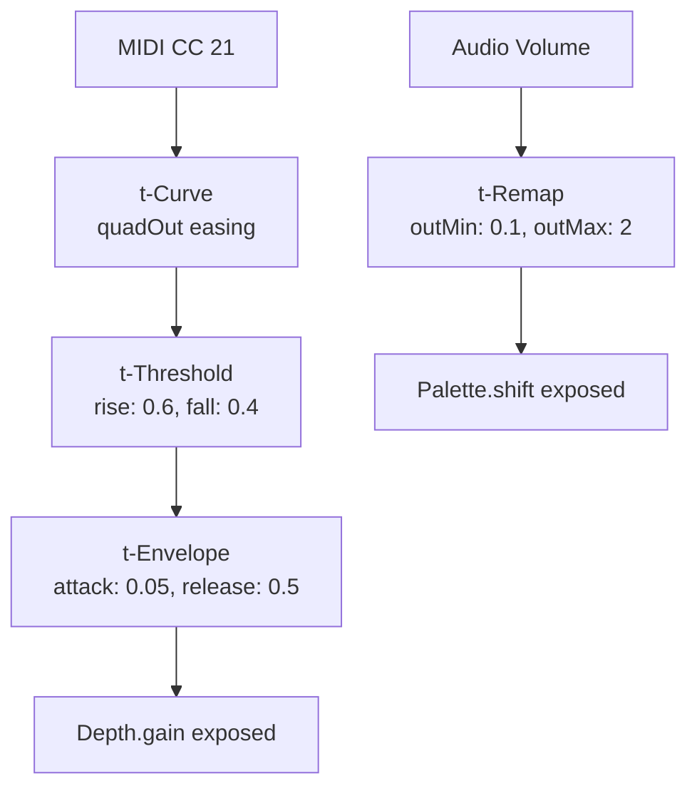

# External Integrations

{: .no_toc }

Points accepts real-time input from MIDI controllers, OSC messages, Vision body tracking, and audio analysis. It can also output via NDI and record MP4 video. This guide covers setting up each integration and syncing external inputs to visual effects.

## Table of contents
{: .text-delta }
- TOC
{:toc}

---

## MIDI Controllers

{: .warning }
MIDI input requires an external MIDI controller connected to your iOS device via USB or Bluetooth MIDI.

### Setup

1. Connect your MIDI controller to the iPad/iPhone (USB-C hub or Bluetooth).
2. Points auto-detects connected MIDI devices — no pairing step needed.
3. Add a **MIDI CC** node from the Body family to read a specific control change number.
4. Wire its output into any exposed param on another node.

### Example: MIDI Knob → Noise Period



Route CC 21 (a knob) to Noise's period, sweeping from tight grain to slow undulation. Then the noise output drives Size for organic breathing pins.

### Available MIDI Nodes

| Node | What It Reads |
|------|--------------|
| **MIDI CC** | A specific control change number (0–127) scaled to 0–1 |
| **MIDI Note** | Note-on velocity for a chosen note number — fires a trigger on each press |
| **MIDI Pitch Bend** | Pitch wheel position (−1 to +1) |
| **MIDI Clock** | BPM from an external clock source (syncs LFOs, Spin rates) |

### Syncing MIDI to Visual Effects

The key pattern: MIDI → control-rate shaping → exposed GPU param:



Use a **t-Remap** node to scale the MIDI range into the exact parameter range you want. A knob that goes 0–1 can be remapped to 0.02–1.0 (period) or −0.5–0.5 (palette shift).

---

## OSC (Open Sound Control)

Points runs an OSC server that listens for messages from TouchDesigner, Max/MSP, Processing, or any OSC-capable app.

### Setup

1. Ensure Points and your OSC sender are on the same Wi-Fi network.
2. Points listens on port **9000** by default (configurable in Settings).
3. Send OSC messages to `/points/param <nodeID> <paramName> <value>`.

### OSC Address Patterns

| Pattern | Effect |
|---------|--------|
| `/points/param <nodeID> <param> <float>` | Set a node's slider |
| `/points/trigger <nodeID> <port>` | Fire a trigger port |
| `/points/shockwave <x> <y>` | Fire a shockwave at view position |
| `/points/bpm <float>` | Set the global BPM |
| `/points/palette <nodeID> <name>` | Switch a Palette node's color map |
| `/points/colorMode <string>` | Set global color mode (none/video/palette) |

### Example: TouchDesigner → Points

```
# Send a sine wave LFO to the Twist angle
/points/param twist angle 0.25

# Fire a shockwave at center
/points/shockwave 0.5 0.5

# Switch palette to viridis
/points/palette palette1 viridis
```

### Creating a Bidirectional OSC ↔ Visual Pipeline



---

## NDI Video Output

Points can send its rendered viewport as an NDI stream — a high-quality, low-latency video protocol used in live production.

### Setup

1. Add an **NDI** node from the Output family.
2. Configure the stream name (appears as a source in NDI receivers).
3. The stream carries the viewport with alpha channel — usable as a key/fill source in OBS, vMix, or TouchDesigner.

### NDI Settings

| Setting | Default | Description |
|---------|---------|-------------|
| Stream Name | "Points" | Name visible to NDI receivers |
| Frame Rate | 30 | 30 or 60 fps |
| Alpha Key | On | Transparent background for compositing |

### Example: Points → OBS → Stream



---

## MP4 Recording

Points can record the viewport directly to the Photos library.

1. Add a **Record** node from the Output family.
2. Tap the record button to start/stop.
3. Files save as H.264 MP4 at 30fps to the Photos app.

---

## Audio Analysis

Points analyzes the device microphone in real time, exposing FFT bands, beat detection, and volume as mod sources.

### Audio Nodes

| Node | Output | Description |
|------|--------|-------------|
| **Audio Volume** | `volume` (signal) | RMS volume 0–1 |
| **Audio FFT** | `low` `mid` `high` (signal) | Three-band frequency split |
| **Beat Detect** | `beat` (trigger) | Pulses on detected transients |
| **Onset** | `onset` (trigger) | Fires on note attacks |

### Example: Audio-Reactive Cloud



- Volume controls point size (loud = big)
- Beat fires shockwaves on each kick drum
- Low frequencies shift the color palette

---

## Vision Body Tracking

Points uses Apple's Vision framework for real-time body and hand tracking via the front TrueDepth camera.

### Body Nodes

| Node | Outputs | Description |
|------|---------|-------------|
| **Hand Position** | `x` `y` (signal) | Normalized hand position 0–1 |
| **Pinch** | `distance` (signal) | Pinch distance (0 touching → wide) |
| **Gestures** | `palm` `fist` `peace` `point` (trigger) | Recognized hand gestures |
| **Head Pose** | `yaw` `pitch` `roll` (signal) | Head orientation in radians |
| **Face Blendshapes** | `jawOpen` `mouthSmile` etc. (signal) | 52 ARKit blendshape coefficients |

### Example: Hand-Controlled Point Cloud



- Moving your hand left/right twists the cloud
- Hand height controls point size
- Pinching scatters points
- Making a fist fires a shockwave

---

## Syncing External Inputs to Visual Effects

The general pattern for any external input → visual effect:



1. **Capture** the input (MIDI CC, OSC message, audio FFT band, hand position)
2. **Shape** it through a control-rate node (Remap, Curve, Threshold, Envelope, Spring)
3. **Expose** the target param on the destination node
4. **Wire** the shaped signal into the exposed port

{: .tip }
Use **t-Remap** to scale any 0–1 input into the exact range your target parameter expects. For example, a MIDI knob (0–1) → t-Remap (outMin: 0.02, outMax: 1.0) → Noise.period.

### Building Complex Modulation Chains



This chain: MIDI knob → easing curve → threshold detector → envelope → drives Depth gain. Meanwhile, audio volume independently shifts the palette.
