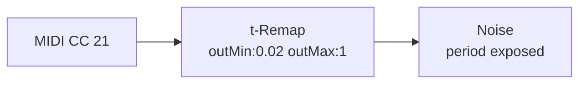
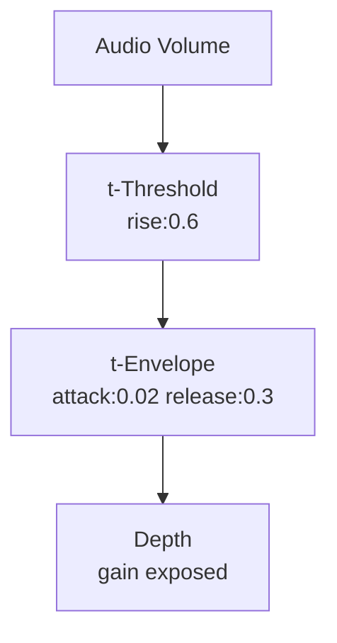
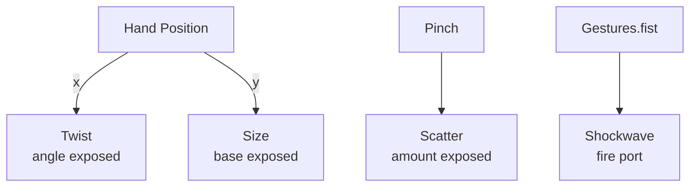

# Integrations

Points accepts real-time input from MIDI, OSC, audio, and Vision body tracking. It outputs via NDI and MP4 recording.

## MIDI

Connect a MIDI controller via USB or Bluetooth. Points auto-detects devices.

| Node | Reads | Output |
|------|-------|--------|
| MIDI CC | Control Change number 0–127 | `signal` 0–1 |
| MIDI Note | Note-on velocity | `trigger` + velocity |
| MIDI Pitch Bend | Pitch wheel | `signal` −1 to +1 |
| MIDI Clock | External BPM | syncs LFO/Clock |

**Pattern:** MIDI → t-Remap (scale range) → exposed param



## OSC

Points listens on port 9000 for OSC messages.

| Address | Effect |
|---------|--------|
| `/points/param <nodeID> <param> <float>` | Set slider |
| `/points/trigger <nodeID> <port>` | Fire trigger |
| `/points/shockwave <x> <y>` | Fire shockwave at UV position |
| `/points/bpm <float>` | Set BPM |

## NDI Output

Add an NDI node (Output family). The rendered viewport streams as an NDI source with alpha channel — usable in OBS, vMix, or TouchDesigner.

| Setting | Default |
|---------|---------|
| Stream Name | "Points" |
| FPS | 30 |
| Alpha Key | on |

## MP4 Recording

Add a Record node (Output family). Toggle recording to save H.264 MP4 to Photos.

## Audio Analysis

Points analyzes the microphone in real time.

| Node | Output |
|------|--------|
| Audio Volume | `volume` 0–1 RMS |
| Audio FFT | `low` `mid` `high` bands |
| Beat Detect | `beat` trigger on transients |

**Pattern:** Audio → Threshold → Envelope → exposed param



## Vision Body Tracking

Uses Apple Vision framework via front TrueDepth camera.

| Node | Output |
|------|--------|
| Hand Position | `x` `y` signal 0–1 |
| Pinch | `distance` signal |
| Gestures | `palm` `fist` `peace` `point` triggers |
| Head Pose | `yaw` `pitch` `roll` signals |
| Face Blendshapes | 52 ARKit coefficients |

**Pattern:** Body signal → shaping params → exposed param



## The Modulation Chain

All external inputs follow the same pattern:

```
EXTERNAL INPUT  →  SHAPE (Remap/Curve)  →  EXPOSED PARAM  →  GPU PIPELINE
```

1. Capture the input (MIDI CC, OSC message, audio band, hand position)
2. Shape it through a control-rate node (t-Remap, t-Curve, t-Threshold, t-Envelope)
3. Expose the target param on the destination node
4. Wire the shaped signal into the exposed port
