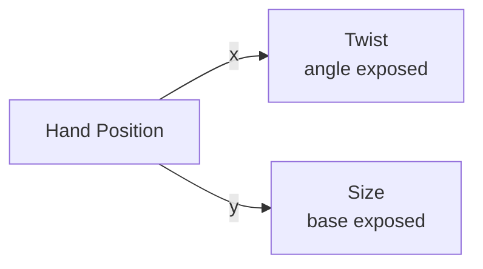
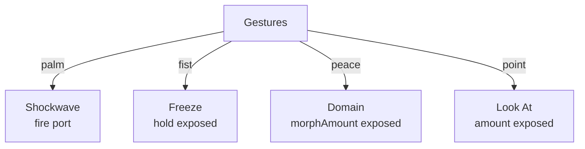
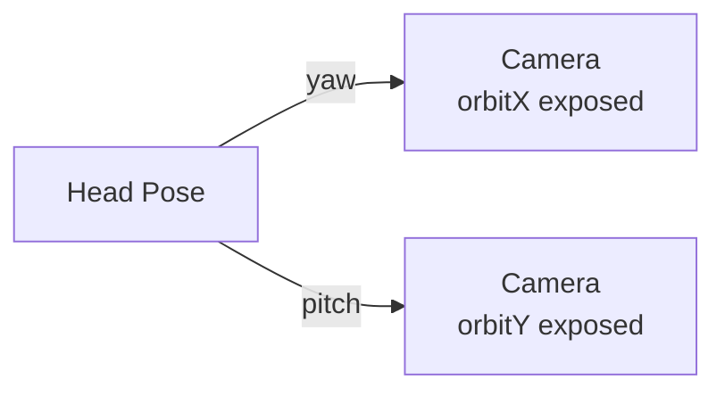
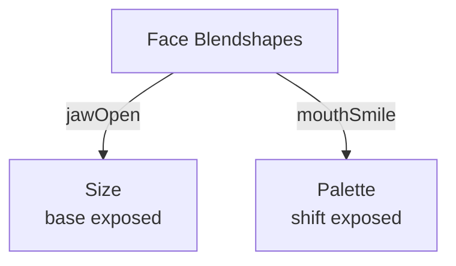

# Body Nodes

{: .no_toc }

Body nodes use Apple's Vision framework for real-time hand, face, and body tracking via the front TrueDepth camera. They produce control-rate signals and triggers you wire into exposed params.

## Table of contents
{: .text-delta }
- TOC
{:toc}

---

## Hand Position

**ID:** `hand-position` · **Family:** body · **Execution:** CPU (control)

Normalized hand position from Vision hand tracking.

### Shared Vision Shaping Parameters

All continuous body nodes share these shaping params:

| Param | Range | Default | Description |
|-------|-------|---------|-------------|
| `gain` | 0–4 | 1 | Multiplier on raw value |
| `inMin` | 0–1 | 0 | Input remap start |
| `inMax` | 0–1 | 1 | Input remap end |
| `outMin` | 0–1 | 0 | Output remap start |
| `outMax` | 0–1 | 1 | Output remap end |
| `deadzone` | 0–0.5 | 0 | Center dead zone |
| `smoothing` | 0–1 | 0 | Temporal smooth |
| `invert` | bool | false | Invert output |

### Ports

| Port | Direction | Type | Description |
|------|-----------|------|-------------|
| `x` | output | signal | Horizontal position 0–1 |
| `y` | output | signal | Vertical position 0–1 |

### Example: Hand → Twist + Size

### Variants

- **Hand Position (Left)** — Left hand only
- **Hand Position (Right)** — Right hand only
- **Hand Position (First)** — First detected hand

---

## Pinch

**ID:** `pinch` · **Family:** body · **Execution:** CPU (control)

Hand pinch distance. 0 = fingertips touching, wide = hand open.

### Pinch-Specific Params

| Param | Range | Default | Description |
|-------|-------|---------|-------------|
| `gain` | 0–4 | 1 | Multiplier |
| `inMin/Max` | 0–1 | 0 / 1 | Input range |
| `outMin/Max` | 0–10 | 0 / 10 | Output range (wider than vision params) |
| `deadzone` | 0–0.5 | 0 | Dead zone |
| `smoothing` | 0–1 | 0 | Smoothing |
| `invert` | bool | false | Invert |

### Ports

| Port | Direction | Type | Description |
|------|-----------|------|-------------|
| `distance` | output | signal | Pinch distance |

### Example: Pinch → Scatter

### Variants

- **Pinch (Left)** — Left hand pinch
- **Pinch (Right)** — Right hand pinch
- **Pinch (First)** — First detected hand pinch

---

## Gestures

**ID:** `gestures` · **Family:** body · **Execution:** CPU (control)

Recognized hand gestures from Vision. Fires continuous signal while gesture is held.

### Parameters

| Param | Range | Default | Description |
|-------|-------|---------|-------------|
| `hold` | 0–3 | 0.25 | How long the signal lingers after gesture ends |
| `smoothing` | 0–1 | 0 | Temporal smoothing |

### Ports

| Port | Direction | Type | Description |
|------|-----------|------|-------------|
| `palm` | output | trigger | Open palm detected |
| `fist` | output | trigger | Closed fist detected |
| `peace` | output | trigger | Peace sign detected |
| `point` | output | trigger | Pointing finger detected |

### Example: Gestures → Effects

### Variants

- **Gestures (Left)** — Left hand only
- **Gestures (Right)** — Right hand only

---

## Head Pose

**ID:** `head-pose` · **Family:** body · **Execution:** CPU (control)

Head orientation from the TrueDepth camera.

### Ports

| Port | Direction | Type | Description |
|------|-----------|------|-------------|
| `yaw` | output | signal | Left/right rotation |
| `pitch` | output | signal | Up/down rotation |
| `roll` | output | signal | Tilt |

### Example: Head → Camera Orbit

Looking around physically orbits the camera view.

---

## Face Blendshapes

**ID:** `face-blendshapes` · **Family:** body · **Execution:** CPU (control)

52 ARKit blendshape coefficients from the TrueDepth camera.

### Key Ports

| Port | Description |
|------|-------------|
| `jawOpen` | Jaw openness |
| `mouthSmile` | Smile amount |
| `mouthFrown` | Frown amount |
| `eyeBlinkLeft/Right` | Eye blink |
| `browDownLeft/Right` | Brow furrow |
| `mouthPucker` | Pucker |
| `cheekPuff` | Cheek puff |

### Example: Face → Audio Visualization

Opening your mouth swells the point cloud; smiling shifts the palette.
