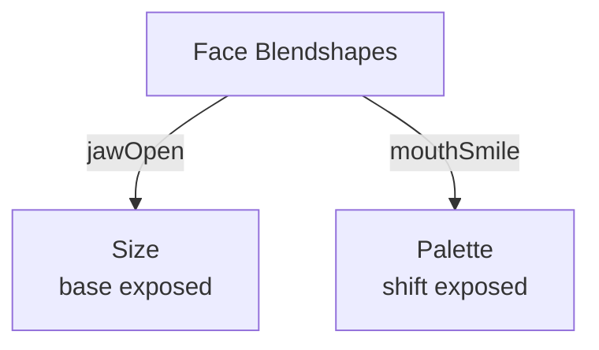

# Face Blendshapes

**ID** `face-blendshapes` · **Family** BODY · **CPU** (control)

52 ARKit blendshape coefficients from TrueDepth.

| Key Ports | Description |
|-----------|-------------|
| `jawOpen` | Jaw openness |
| `mouthSmile` | Smile amount |
| `eyeBlinkLeft/Right` | Eye blink |
| `browDownLeft/Right` | Brow furrow |
| `mouthPucker` | Pucker |

