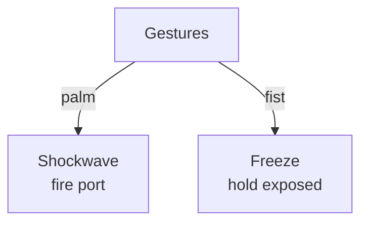

# Gestures

**ID** `gestures` · **Family** BODY · **CPU** (control)

Recognized hand gestures from Vision.

| Param | Range | Default | Description |
|-------|-------|---------|-------------|
| `hold` | 0 – 3 | 0.25 | Linger after gesture ends |
| `smoothing` | 0 – 1 | 0 | Smooth |

| Port | Direction | Type |
|------|-----------|------|
| `palm` | output | trigger |
| `fist` | output | trigger |
| `peace` | output | trigger |
| `point` | output | trigger |

