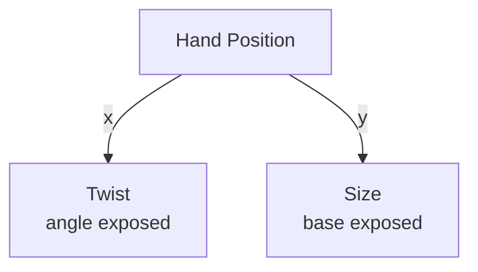

# Hand Position

**ID** `hand-position` · **Family** BODY · **CPU** (control)

Normalized hand position from Vision hand tracking.

| Param | Range | Default | Description |
|-------|-------|---------|-------------|
| `gain` | 0 – 4 | 1 | Multiplier |
| `inMin/inMax` | 0 – 1 | 0/1 | Input range |
| `outMin/outMax` | 0 – 1 | 0/1 | Output range |
| `deadzone` | 0 – 0.5 | 0 | Center dead zone |
| `smoothing` | 0 – 1 | 0 | Temporal smooth |
| `invert` | bool | false | Invert |

| Port | Direction | Type |
|------|-----------|------|
| `x` | output | signal |
| `y` | output | signal |

Variants: Hand Position (Left), Hand Position (Right), Hand Position (First).

