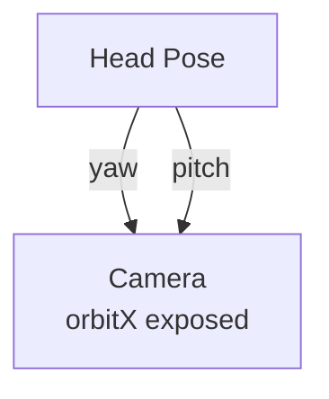

# Head Pose

**ID** `head-pose` · **Family** BODY · **CPU** (control)

Head orientation from TrueDepth camera.

| Port | Direction | Type |
|------|-----------|------|
| `yaw` | output | signal |
| `pitch` | output | signal |
| `roll` | output | signal |

