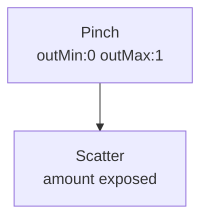

# Pinch

**ID** `pinch` · **Family** BODY · **CPU** (control)

Hand pinch distance. 0 = fingertips touching.

| Param | Range | Default | Description |
|-------|-------|---------|-------------|
| `gain` | 0 – 4 | 1 | Multiplier |
| `outMin/outMax` | 0 – 10 | 0/10 | Output range (wider than vision) |
| `smoothing` | 0 – 1 | 0 | Smooth |
| `invert` | bool | false | Invert |

| Port | Direction | Type |
|------|-----------|------|
| `distance` | output | signal |

