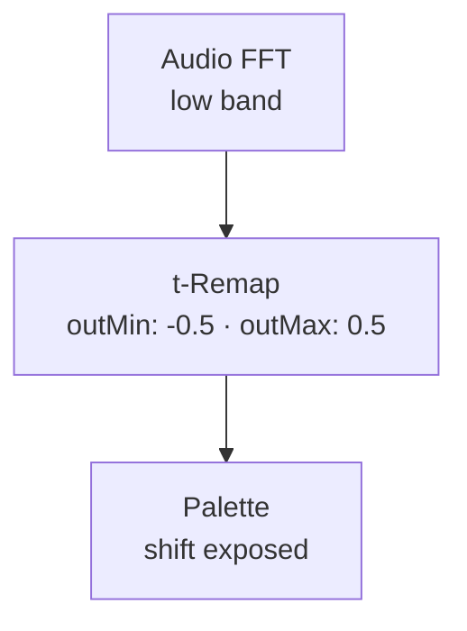
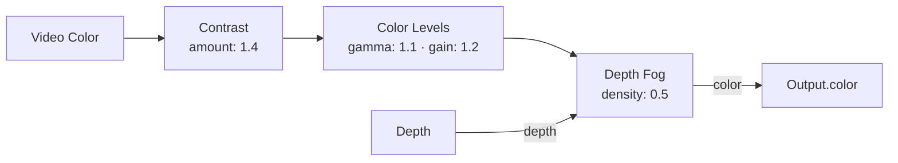

# Color Nodes

{: .no_toc }

Color nodes transform per-pin color — palette mapping, image processing, blending, and atmospheric effects. They operate on `fieldColor` (RGBA per pin) and chain together.

## Table of contents
{: .text-delta }
- TOC
{:toc}

---

## Palette

**ID:** `palette` · **Family:** color · **Execution:** GPU (interpreterOp)

Maps any 0–1 value through a color lookup table. The primary colorization node.

### Parameters

| Param | Range | Default | Description |
|-------|-------|---------|-------------|
| `map` | thermal / viridis / plasma / inferno / magma / cividis / turbo / coolwarm / ... | thermal | Color gradient |
| `shift` | −1–1 | 0 | Hue shift (wraps around the palette) |

### Ports

| Port | Direction | Type | Description |
|------|-----------|------|-------------|
| `t` | input | fieldFloat | Value to map (0–1) |
| `color` | output | fieldColor | Mapped RGBA color |

### Example: Depth → Palette

### Trigger: Audio → Palette Shift

Bass frequencies shift the entire palette — warm on kicks, cool on quiet.

---

## Light Gradient

**ID:** `light-gradient` · **Family:** color · **Execution:** GPU (interpreterOp)

Maps how bright each pin's camera color is onto a colormap. Light becomes a gradient.

| Param | Range | Default | Description |
|-------|-------|---------|-------------|
| `map` | palette names | thermal | Color map |
| `intensity` | 0–3 | 1 | Brightness multiplier |

---

## Duotone

**ID:** `duotone` · **Family:** color · **Execution:** GPU (interpreterOp)

Two-tone remap: dark pins take shadow color, bright pins take light color. Classic risograph look.

| Param | Range | Default | Description |
|-------|-------|---------|-------------|
| `shadowR/G/B` | 0–1 | 0.1 / 0.05 / 0.3 | Shadow color |
| `lightR/G/B` | 0–1 | 1 / 0.85 / 0.4 | Light color |

### Example: Video Color → Duotone

---

## Contrast

**ID:** `contrast` · **Family:** color · **Execution:** GPU (interpreterOp)

Pushes colors away from mid-grey. Pivots around 0.5.

| Param | Range | Default | Description |
|-------|-------|---------|-------------|
| `amount` | 0–3 | 1.4 | 1 = unchanged; >1 crunchier; <1 flatter |

---

## Color Invert

**ID:** `color-invert` · **Family:** color · **Execution:** GPU (interpreterOp)

Photographic negative with crossfade control.

| Param | Range | Default | Description |
|-------|-------|---------|-------------|
| `amount` | 0–1 | 1 | 0 = original; 1 = full negative |

---

## Color Gamma

**ID:** `color-gamma` · **Family:** color · **Execution:** GPU (interpreterOp)

Per-channel gamma power curve.

| Param | Range | Default | Description |
|-------|-------|---------|-------------|
| `gamma` | 0.2–4 | 1 | <1 lifts shadows; >1 deepens them |

---

## Threshold Color

**ID:** `threshold-color` · **Family:** color · **Execution:** GPU (interpreterOp)

Two flat colors split at a brightness level. High-contrast poster/duochrome effect.

| Param | Range | Default | Description |
|-------|-------|---------|-------------|
| `level` | 0–1 | 0.5 | Brightness split point |
| `darkR/G/B` | 0–1 | 0 / 0 / 0.15 | Below-threshold color |
| `liteR/G/B` | 0–1 | 1 / 0.95 / 0.8 | Above-threshold color |

---

## Color Levels

**ID:** `color-levels` · **Family:** color · **Execution:** GPU (interpreterOp)

Full tone control: gamma curve, then gain (multiply), then lift (add).

| Param | Range | Default | Description |
|-------|-------|---------|-------------|
| `gamma` | 0.2–4 | 1 | Power curve |
| `gain` | 0–3 | 1 | Multiply |
| `lift` | −0.5–0.5 | 0 | Add (brightness offset) |

---

## Color Clamp

**ID:** `color-clamp` · **Family:** color · **Execution:** GPU (interpreterOp)

Clips every channel to [low, high]. Crush blacks, clamp highlights.

| Param | Range | Default | Description |
|-------|-------|---------|-------------|
| `low` | 0–1 | 0 | Black floor |
| `high` | 0–1 | 1 | White ceiling |

---

## Screen Blend

**ID:** `color-screen` · **Family:** color · **Execution:** GPU (interpreterOp)

Screen blend: 1−(1−a)(1−b). Only ever brightens — great for glow layers.

### Ports

| Port | Direction | Type | Description |
|------|-----------|------|-------------|
| `a` | input | fieldColor | Base color |
| `b` | input | fieldColor | Blend color |
| `out` | output | fieldColor | Screened result |

---

## Depth Fog

**ID:** `depth-fog` · **Family:** color · **Execution:** GPU (interpreterOp)

Blends pins toward a fog color as they get farther away — atmospheric depth cue.

| Param | Range | Default | Description |
|-------|-------|---------|-------------|
| `fogR/G/B` | 0–1 | 0.05 / 0.06 / 0.1 | Fog color |
| `density` | 0–1 | 0.6 | Fog strength |

### Ports

| Port | Direction | Type | Description |
|------|-----------|------|-------------|
| `color` | input | fieldColor | Base color |
| `depth` | input | fieldFloat | Nearness (0 = far, 1 = near) |
| `color` | output | fieldColor | Fogged color |

### Example: Full Color Pipeline

