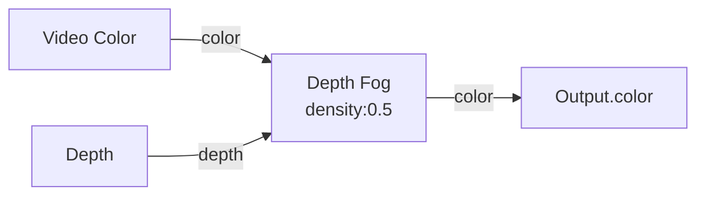

# Depth Fog

**ID** `depth-fog` · **Family** COLOR · **GPU** (interpreterOp)

Blends pins toward fog color as they get farther — atmospheric depth cue.

| Param | Range | Default | Description |
|-------|-------|---------|-------------|
| `fogR/G/B` | 0 – 1 | 0.05/0.06/0.1 | Fog color |
| `density` | 0 – 1 | 0.6 | Fog strength |

| Port | Direction | Type |
|------|-----------|------|
| `color` | input | fieldColor |
| `depth` | input | fieldFloat |
| `color` | output | fieldColor |

