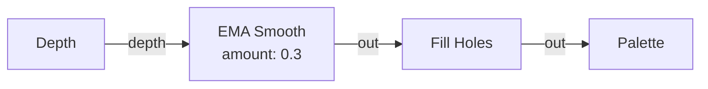
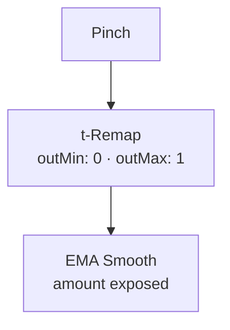
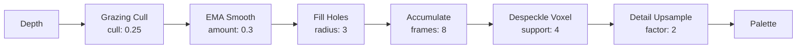

# Filter Nodes

{: .no_toc }

Filter nodes clean and stabilize the raw depth data before it enters the FX pipeline. They address sensor noise, IR shadow holes, flying pixels, and temporal jitter. Most filters work by node presence — just add them anywhere on the depth wire; the depth field passes through.

## Table of contents
{: .text-delta }
- TOC
{:toc}

---

## EMA Smooth

**ID:** `ema-smooth` · **Family:** filter · **Execution:** GPU (interpreterOp)

Temporal exponential moving average. Smooths sensor jitter without motion blur. Deadband hysteresis holds still surfaces perfectly steady; velocity-adaptive alpha snaps the filter awake on fast motion.

### Parameters

| Param | Range | Default | Description |
|-------|-------|---------|-------------|
| `amount` | 0–1 | 0.3 | 0 = raw sensor; 1 = statue. Scales the smoothing strength |
| `deadband` | 0–0.05 | 0.008 | Hold threshold in metres (scaled by amount). Higher = stiller statics |
| `adapt` | 0–10 | 5 | Motion response. Higher = faster wake-up when things move |

### Ports

| Port | Direction | Type | Description |
|------|-----------|------|-------------|
| `depth` | input | fieldFloat | Raw depth input |
| `out` | output | fieldFloat | Smoothed depth |

### Example: EMA in the Cleanup Chain

### Trigger: Gesture → EMA Amount

Pinching tight freezes the depth (statue mode); opening up returns to raw sensor.

---

## Fill Holes

**ID:** `fill-holes` · **Family:** filter · **Execution:** GPU (interpreterOp)

Fills IR-shadow holes in the depth map. Each invalid pixel fills from valid neighbors within the radius, foreground-only — the shadow closes onto the face, never blending face with background.

### Parameters

| Param | Range | Default | Description |
|-------|-------|---------|-------------|
| `radius` | 0–6 | 3 | Search radius in pixels. 0 = fill off (raw holes) |
| `gap` | 0.02–0.3 | 0.08 | Foreground-only band in metres |

---

## Grazing Cull

**ID:** `grazing-cull` · **Family:** filter · **Execution:** GPU (interpreterOp)

Rejects grazing-angle ToF returns and silhouette flying-pixel fringes. The original TDLidar cleanup.

### Parameters

| Param | Range | Default | Description |
|-------|-------|---------|-------------|
| `cull` | 0–1 | 0.25 | Grazing-angle rejection strength (0 = off) |
| `edge` | 0–0.4 | 0.10 | Silhouette flying-pixel reject in metres |
| `gate` | 0–0.05 | 0.006 | Noise floor — solid areas stay rock-still |
| `baseline` | 1–4 | 2 | Surface normal sampling radius in texels |

---

## Apple Depth Filter

**ID:** `apple-depth-filter` · **Family:** filter · **Execution:** GPU (interpreterOp)

Apple's built-in AVFoundation depth smoothing (front camera). Off by default app-wide — add this node to enable it.

| Param | Range | Default | Description |
|-------|-------|---------|-------------|
| `enabled` | bool | true | Toggle Apple's depth filter |

---

## Accumulate

**ID:** `accumulate` · **Family:** filter · **Execution:** GPU (interpreterOp)

Blends multiple frames of depth into a denser, calmer cloud via temporal averaging. Holes keep their accumulated depth.

| Param | Range | Default | Description |
|-------|-------|---------|-------------|
| `frames` | 1–30 | 8 | Number of frames to blend |

---

## Smooth Surface

**ID:** `smooth-surface` · **Family:** filter · **Execution:** GPU (interpreterOp)

Bilateral surface smoothing. Flattens sensor noise on surfaces without bleeding across silhouette edges.

| Param | Range | Default | Description |
|-------|-------|---------|-------------|
| `radius` | 0–4 | 1 | Filter radius in pixels (0 = off) |
| `sigma` | 0.01–0.2 | 0.05 | Depth range that counts as the same surface in metres |

---

## Despeckle Voxel

**ID:** `despeckle-voxel` · **Family:** filter · **Execution:** GPU (interpreterOp)

Removes isolated speckle returns. A point survives only with enough supporting neighbors within the size threshold.

| Param | Range | Default | Description |
|-------|-------|---------|-------------|
| `size` | 0–0.1 | 0.02 | Neighbor search radius in metres |
| `support` | 1–8 | 4 | Required neighbor count (higher = stricter) |

---

## Detail Upsample

**ID:** `detail-upsample` · **Family:** filter · **Execution:** GPU (interpreterOp)

Joint bilateral depth upsample (JBU). Depth is resampled at higher resolution with edges snapped to the RGB image for sharper silhouettes.

| Param | Range | Default | Description |
|-------|-------|---------|-------------|
| `factor` | 1–4 | 2 | Resolution multiplier |
| `edge` | 0.02–0.3 | 0.08 | Color difference threshold for edge snapping |

### Example: Full Cleanup Chain

