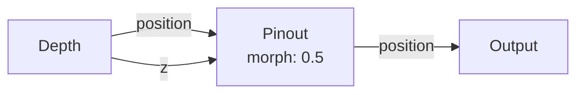
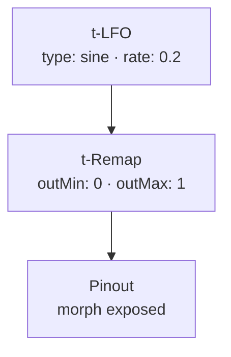
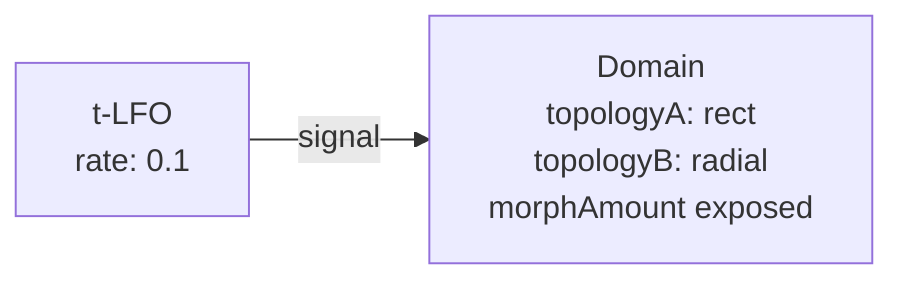
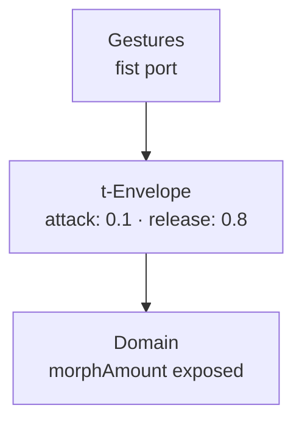
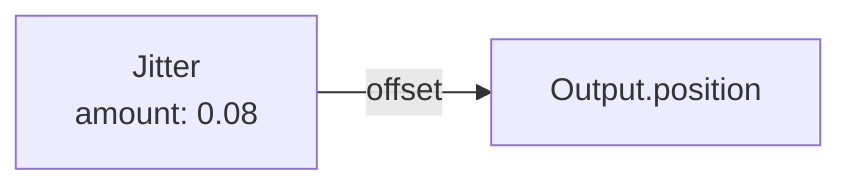
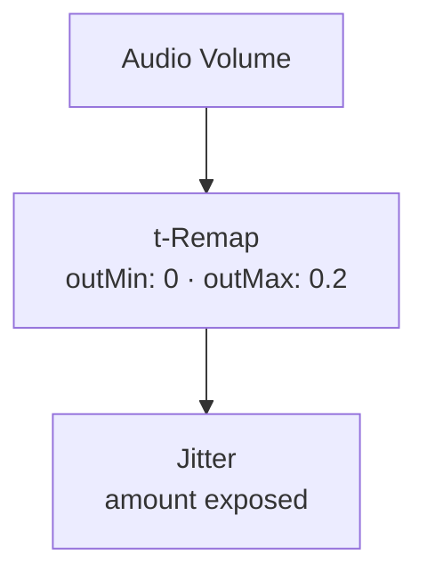
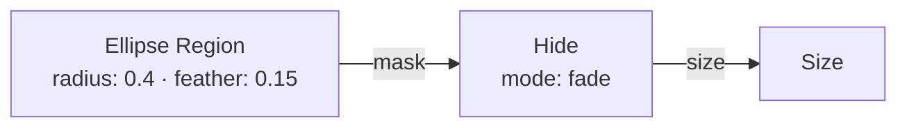
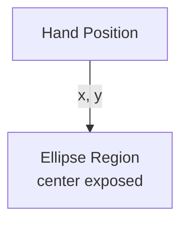

# Grid Nodes

{: .no_toc }

Grid nodes define the spatial organization of the point cloud — topology, pin layout, UV mapping, and masking regions. They control *where* each pin lives on the screen before any depth or movement is applied.

## Table of contents
{: .text-delta }
- TOC
{:toc}

---

## Grid Info

**ID:** `grid-info` · **Family:** grid · **Execution:** GPU (interpreterOp)

Provides per-pin identity constants: UV coordinates, normalized index, stable hash, and distance from center. These are the foundational values that most FX nodes use for per-pin variation.

### Ports

| Port | Direction | Type | Description |
|------|-----------|------|-------------|
| `uv` | output | fieldVec3 | UV coordinate (0–1 grid position) |
| `index` | output | fieldFloat | Normalized pin index 0–1 |
| `hash` | output | fieldFloat | Stable per-pin random 0–1 |
| `centerDist` | output | fieldFloat | Distance from view center 0–1 |

---

## Pinout

**ID:** `pinout` · **Family:** grid · **Execution:** GPU (interpreterOp)

The pin-screen display. XY snaps every point back to its fixed home grid — only the Z push remains, like a physical pin-screen toy. This is the standard display node; wire Depth → Pinout → Output.

### Parameters

| Param | Range | Default | Description |
|-------|-------|---------|-------------|
| `morph` | 0–1 | 0 | 0 = locked grid (classic pin-screen); 1 = untouched cloud |
| `gain` | 0–2 | 1 | Z push multiplier |

### Ports

| Port | Direction | Type | Description |
|------|-----------|------|-------------|
| `position` | input | fieldVec3 | Point position offsets |
| `z` | input | fieldFloat | Z push amount |
| `position` | output | fieldVec3 | Final pin-screen positions |
| `z` | output | fieldFloat | Passthrough Z |

### Example: Pinout with Morph Blend

At morph 0.5, pins are halfway between the rigid grid and the raw cloud.

### Trigger Modulation: LFO → Morph

A slow LFO breathes the pin-screen between rigid grid and free cloud.

---

## Domain

**ID:** `domain` · **Family:** grid · **Execution:** render

The pin lattice topology. Determines how pins are arranged across the viewport.

### Parameters

| Param | Range | Default | Description |
|-------|-------|---------|-------------|
| `topologyA` | rect / hex / radial / spiral / scatter / perspective | rect | Primary topology |
| `topologyB` | rect / hex / radial / spiral / scatter / perspective | radial | Secondary topology (for morphing) |
| `morphAmount` | 0–1 | 0 | Blend A→B (0 = pure A, 1 = pure B) |

### Topology Types

| Type | Description |
|------|-------------|
| **rect** | Standard rectangular grid (rows × columns) |
| **hex** | Honeycomb — odd rows offset by half a cell |
| **radial** | Concentric rings — x = angle, y = ring radius |
| **spiral** | Sunflower spiral (Fermat's spiral) |
| **scatter** | Random distribution across the frame |
| **perspective** | Perspective-projected grid (vanishing point) |

### Example: Morphing Topology

A slow LFO morphs the entire lattice from rectangular to radial — the cloud reflows live.

### Trigger: Gesture → Topology Snap

Making a fist snaps the topology from rect to radial, then it eases back.

---

## Jitter

**ID:** `jitter` · **Family:** grid · **Execution:** GPU (interpreterOp)

Nudges each pin's home position by a seeded random offset — breaks machine-perfect regularity.

### Parameters

| Param | Range | Default | Description |
|-------|-------|---------|-------------|
| `amount` | 0–0.3 | 0.05 | Maximum random displacement |
| `seed` | 0–9999 | 1 | Random seed (change for different pattern) |

### Ports

| Port | Direction | Type | Description |
|------|-----------|------|-------------|
| `amount` | input | fieldFloat | Per-pin jitter amount |
| `offset` | output | fieldVec3 | Random XYZ offsets |

### Example: Jitter → Displace

### Trigger: Audio → Jitter Amount

Louder = jitterier grid. Quiet = perfect lattice.

---

## Region Nodes

### Ellipse Region

**ID:** `region-ellipse` · **Family:** grid · **Execution:** GPU (interpreterOp)

Soft circular mask in view space: 1 inside, 0 outside.

| Param | Range | Default | Description |
|-------|-------|---------|-------------|
| `radius` | 0.02–1 | 0.3 | Circle radius in UV space |
| `feather` | 0–0.5 | 0.12 | Edge softness |
| `invert` | bool | false | Invert mask (hole instead of spotlight) |

### Rect Region

**ID:** `region-rect` · **Family:** grid · **Execution:** GPU (interpreterOp)

Soft rectangular mask.

| Param | Range | Default | Description |
|-------|-------|---------|-------------|
| `width` | 0.1–3 | 1.5 | Box width in UV space |
| `height` | 0.1–4 | 2 | Box height in UV space |
| `feather` | 0.01–1 | 0.2 | Edge softness |
| `invert` | bool | false | Invert mask |

### Example: Region Mask → Hide

Everything outside the ellipse fades to invisible.

### Trigger: Hand Position → Region Center

The spotlight follows your hand across the frame.

---

## UV Transform

**ID:** `uv-transform` · **Family:** grid · **Execution:** render

Pans, zooms, and rotates the camera image under the pins without moving them. The cloud stays put while the world slides through.

| Param | Range | Default | Description |
|-------|-------|---------|-------------|
| `offsetX` | −1–1 | 0 | Horizontal pan |
| `offsetY` | −1–1 | 0 | Vertical pan |
| `scale` | 0.25–4 | 1 | Zoom |
| `rotate` | −0.5–0.5 | 0 | Rotation in turns |

---

## Edge Policy

**ID:** `edge-policy` · **Family:** grid · **Execution:** render

Controls what happens when warps push pins past the frame border.

| Param | Range | Default | Description |
|-------|-------|---------|-------------|
| `mode` | none / fade / clamp | fade | FADE: shrink at edge; CLAMP: pile up; NONE: fly out |
| `margin` | 0–0.3 | 0.05 | Width of the edge transition zone |
