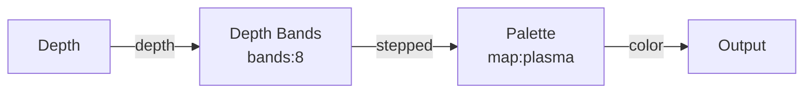

# Depth Bands

**ID** `depth-bands` · **Family** GRID · **GPU** (interpreterOp)

Quantizes a depth field into hard terraced steps — topographic contour bands.

## Parameters

| Param | Range | Default | Description |
|-------|-------|---------|-------------|
| `bands` | 2 – 20 | 6 | Number of terrace levels |

## Ports

| Port | Direction | Type | Description |
|------|-----------|------|-------------|
| `depth` | input | fieldFloat | Depth to quantize |
| `stepped` | output | fieldFloat | Terraced output |

## Standard Use

