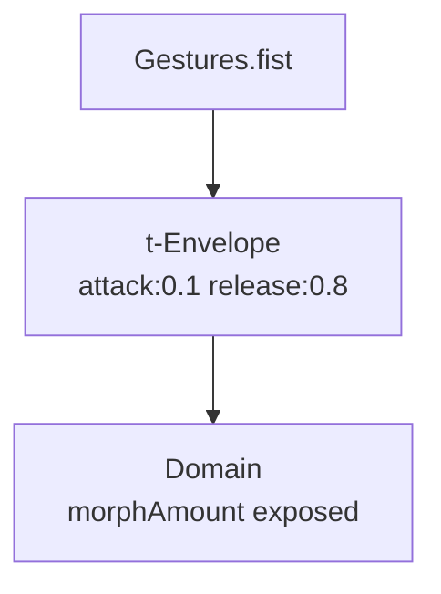

# Domain

**ID** `domain` · **Family** GRID · **Render** (render-read)

The pin lattice topology. Determines how pins are arranged across the viewport.

## Parameters

| Param | Range | Default | Description |
|-------|-------|---------|-------------|
| `topologyA` | rect / hex / radial / spiral / scatter / perspective | rect | Primary topology |
| `topologyB` | rect / hex / radial / spiral / scatter / perspective | radial | Secondary (morph target) |
| `morphAmount` | 0 – 1 | 0 | Blend A→B |

## Topology Types

| rect | Standard rectangular grid |
| hex | Honeycomb — odd rows offset |
| radial | Concentric rings |
| spiral | Sunflower (Fermat) spiral |
| scatter | Random distribution |
| perspective | Vanishing-point projected |

## Trigger Modulation: Gesture → Topology Snap

