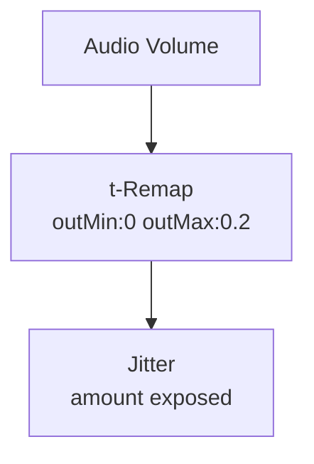

# Jitter

**ID** `jitter` · **Family** GRID · **GPU** (interpreterOp)

Nudges each pin's home by a seeded random offset — breaks machine-perfect regularity.

## Parameters

| Param | Range | Default | Description |
|-------|-------|---------|-------------|
| `amount` | 0 – 0.3 | 0.05 | Max random displacement |
| `seed` | 0 – 9999 | 1 | Random seed |

## Ports

| Port | Direction | Type | Description |
|------|-----------|------|-------------|
| `amount` | input | fieldFloat | Per-pin jitter |
| `offset` | output | fieldVec3 | Random XYZ offsets |

## Trigger Modulation: Audio → Jitter

