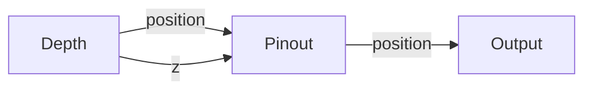
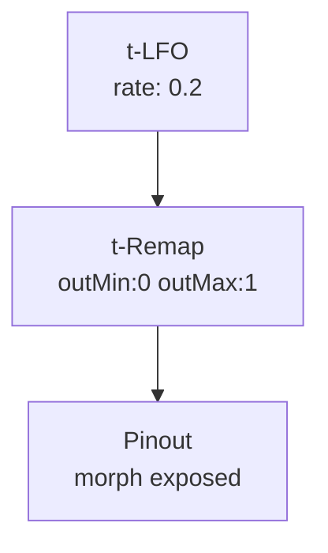

# Pinout

**ID** `pinout` · **Family** GRID · **GPU** (interpreterOp)

The pin-screen display. XY snaps every point to its fixed home grid — only the Z push remains. The standard display node.

## Parameters

| Param | Range | Default | Description |
|-------|-------|---------|-------------|
| `morph` | 0 – 1 | 0 | 0 = locked grid; 1 = untouched cloud |
| `gain` | 0 – 2 | 1 | Z push multiplier |

## Ports

| Port | Direction | Type | Description |
|------|-----------|------|-------------|
| `position` | input | fieldVec3 | Position offsets |
| `z` | input | fieldFloat | Z push |
| `position` | output | fieldVec3 | Final pin-screen positions |
| `z` | output | fieldFloat | Passthrough Z |

## Standard Use

## Trigger Modulation: LFO → Morph

