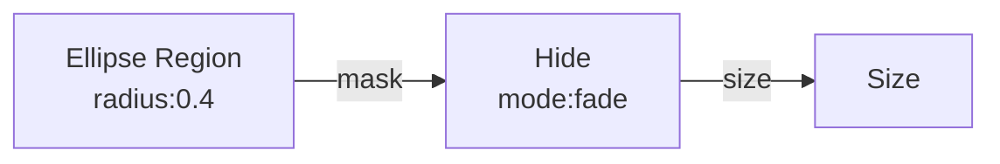
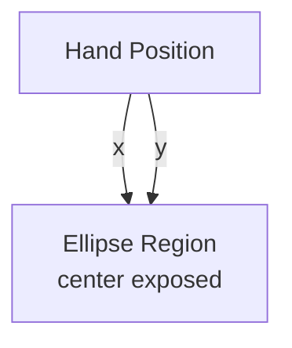

# Ellipse Region

**ID** `region-ellipse` · **Family** GRID · **GPU** (interpreterOp)

Soft circular mask in view space: 1 inside, 0 outside.

## Parameters

| Param | Range | Default | Description |
|-------|-------|---------|-------------|
| `radius` | 0.02 – 1 | 0.3 | Circle radius in UV |
| `feather` | 0 – 0.5 | 0.12 | Edge softness |
| `invert` | bool | false | Invert (hole vs spotlight) |

## Ports

| Port | Direction | Type | Description |
|------|-----------|------|-------------|
| `center` | input | vec2 | Center UV (default 0.5,0.5) |
| `mask` | output | fieldFloat | Soft mask 0–1 |

## Standard Use: Region → Hide

## Trigger: Hand → Region Center

