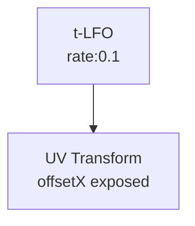

# UV Transform

**ID** `uv-transform` · **Family** GRID · **Render** (render-read)

Pans, zooms, and rotates the camera image under the pins without moving them. The cloud stays put while the world slides through.

## Parameters

| Param | Range | Default | Description |
|-------|-------|---------|-------------|
| `offsetX` | −1 – 1 | 0 | Horizontal pan |
| `offsetY` | −1 – 1 | 0 | Vertical pan |
| `scale` | 0.25 – 4 | 1 | Zoom |
| `rotate` | −0.5 – 0.5 | 0 | Rotation (turns) |

## Trigger: LFO → Drift

