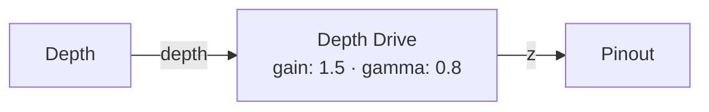
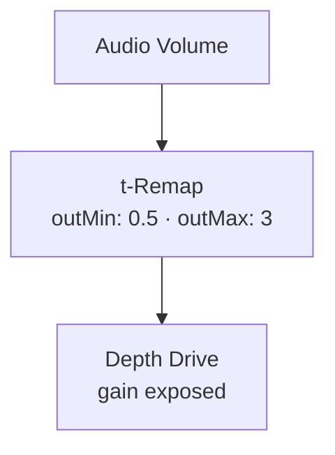
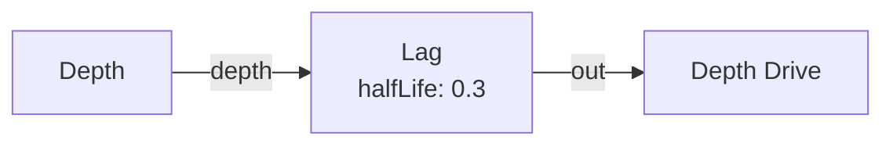
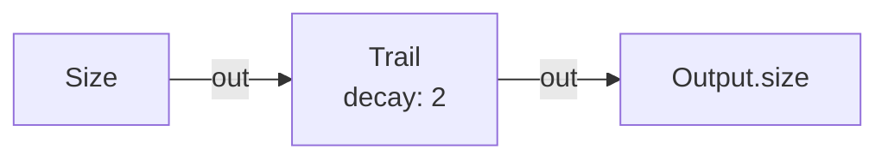
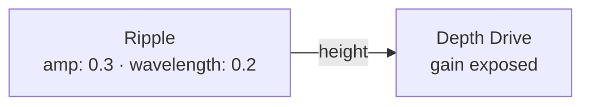
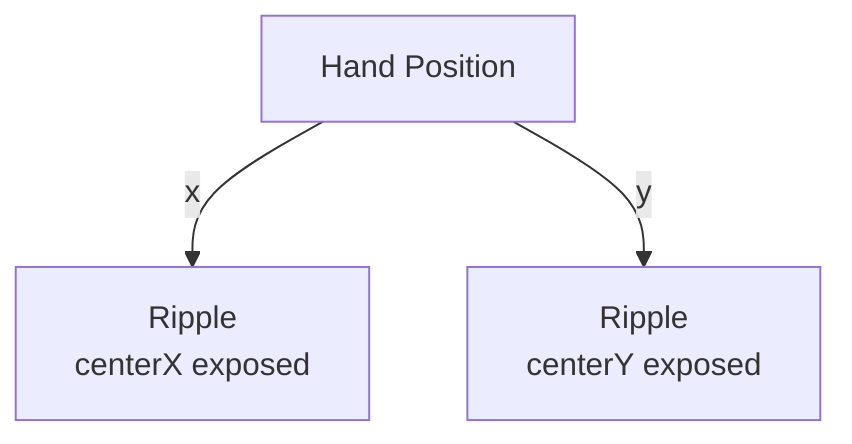
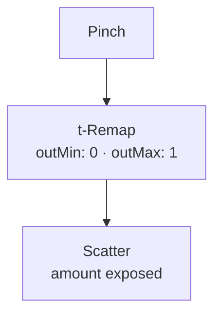
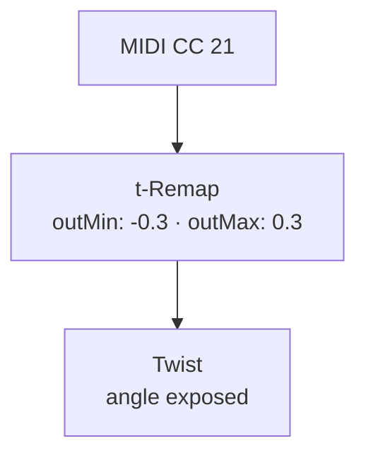
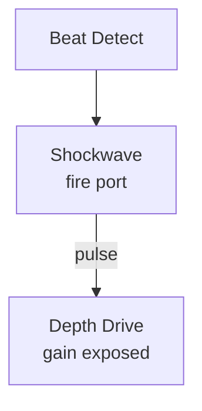
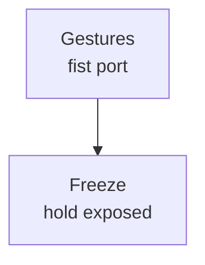

# Move Nodes

{: .no_toc }

Move nodes transform point positions — depth driving, physics simulations, time-based effects, and spatial warps. They produce positional offsets that wire into Pinout or directly to Output.

## Table of contents
{: .text-delta }
- TOC
{:toc}

---

## Depth Drive

**ID:** `depth-drive` · **Family:** move · **Execution:** GPU (interpreterOp)

Pulls pins off the wall toward the camera. The primary way to convert nearness into 3D depth.

### Parameters

| Param | Range | Default | Description |
|-------|-------|---------|-------------|
| `gain` | 0–3 | 1.2 | Z push strength |
| `gamma` | 0.25–4 | 1 | Depth curve (0.5 = squash, 2 = stretch) |

### Ports

| Port | Direction | Type | Description |
|------|-----------|------|-------------|
| `depth` | input | fieldFloat | Nearness 0–1 |
| `z` | output | fieldFloat | Z push amount |

### Example: Depth → Drive → Pinout

### Trigger: Audio → Gain

Volume controls how far pins push out — quiet is flat, loud is deep relief.

---

## Lag

**ID:** `lag` · **Family:** move · **Execution:** GPU (interpreterOp)

Exponential smoothing over time. One float of state per pin. Creates buttery follow effects.

| Param | Range | Default | Description |
|-------|-------|---------|-------------|
| `halfLife` | 0–5 | 0 | Time to reach halfway to target. 0 = passthrough |

### Example: Lag on Depth for Dreamy Motion

---

## Trail

**ID:** `trail` · **Family:** move · **Execution:** GPU (interpreterOp)

Peak-hold with decay: rises instantly, falls slowly. Creates glowing afterimages.

| Param | Range | Default | Description |
|-------|-------|---------|-------------|
| `decay` | 0–10 | 1.5 | Decay speed. 0 = instant (off) |

### Example: Trail on Size for Glow Tails

Points grow instantly but shrink slowly — comet tails.

---

## Ripple

**ID:** `radial-ripple` · **Family:** move · **Execution:** GPU (interpreterOp)

Analytic concentric rings radiating from a center point. Pure math — zero per-pin state.

### Parameters

| Param | Range | Default | Description |
|-------|-------|---------|-------------|
| `amp` | 0–1 | 0 | Ripple height |
| `wavelength` | 0.02–1 | 0.15 | Ring spacing |
| `speed` | −4–4 | 0.5 | Travel speed |
| `falloff` | 0–8 | 2 | Radial fade |
| `centerX` | 0–1 | 0.5 | Center X in UV |
| `centerY` | 0–1 | 0.5 | Center Y in UV |

### Example: Ripple → Depth Drive

### Trigger: Hand → Ripple Center

Ripples radiate from wherever your hand is.

---

## Spring

**ID:** `spring` · **Family:** move · **Execution:** GPU (interpreterOp)

Physical spring simulation per pin. Each point has position + velocity state — wobbles with overshoot.

| Param | Range | Default | Description |
|-------|-------|---------|-------------|
| `stiffness` | 0–40 | 0 | Spring constant. 0 = off (direct follow) |
| `damping` | 0–2 | 0.7 | Damping coefficient |

---

## Scatter

**ID:** `scatter` · **Family:** move · **Execution:** GPU (interpreterOp)

Throws each pin along its own seeded random direction. Amount 0 returns every pin exactly home — stateless.

| Param | Range | Default | Description |
|-------|-------|---------|-------------|
| `amount` | 0–1 | 0 | Scatter strength |
| `seed` | 0–9999 | 3 | Random seed |

### Trigger: Pinch → Scatter

Pinching scatters the cloud; releasing brings it home.

---

## Twist

**ID:** `twist` · **Family:** move · **Execution:** GPU (interpreterOp)

Whirlpools pin positions around the view center. Angle in turns.

| Param | Range | Default | Description |
|-------|-------|---------|-------------|
| `angle` | −0.5–0.5 | 0 | Twist strength in turns |
| `falloff` | 0–4 | 0.8 | Radial falloff |

### Trigger: MIDI → Twist

---

## Shockwave

**ID:** `shockwave` · **Family:** move · **Execution:** GPU (interpreterOp)

Expanding rings fired by triggers. Up to 4 active waves at once.

| Param | Range | Default | Description |
|-------|-------|---------|-------------|
| `speed` | 0–4 | 1.2 | Expansion speed |
| `width` | 0–0.6 | 0.12 | Ring thickness |
| `damping` | 0–6 | 1.2 | Decay rate |

### Trigger: Beat → Shockwave

---

## Freeze

**ID:** `freeze` · **Family:** move · **Execution:** GPU (interpreterOp)

While hold is up, each pin keeps its captured value; release melts back to live.

| Param | Range | Default | Description |
|-------|-------|---------|-------------|
| `hold` | 0–1 | 0 | Freeze amount |

### Trigger: Fist → Freeze

Make a fist to freeze the cloud; release to thaw.
