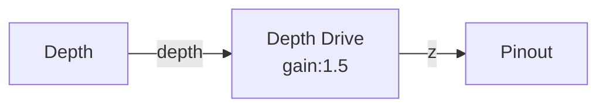

# Depth Drive

**ID** `depth-drive` · **Family** MOVE · **GPU** (interpreterOp)

Pulls pins off the Z-wall toward the camera. The primary depth→Z converter.

| Param | Range | Default | Description |
|-------|-------|---------|-------------|
| `gain` | 0 – 3 | 1.2 | Z push strength |
| `gamma` | 0.25 – 4 | 1 | Depth curve |

| Port | Direction | Type |
|------|-----------|------|
| `depth` | input | fieldFloat |
| `z` | output | fieldFloat |

