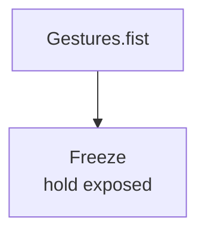

# Freeze

**ID** `freeze` · **Family** MOVE · **GPU** (interpreterOp)

While hold is up, each pin keeps its captured value. Release melts to live.

| Param | Range | Default | Description |
|-------|-------|---------|-------------|
| `hold` | 0 – 1 | 0 | Freeze amount |

| Port | Direction | Type |
|------|-----------|------|
| `in` | input | fieldFloat |
| `out` | output | fieldFloat |

## Trigger: Fist → Freeze

