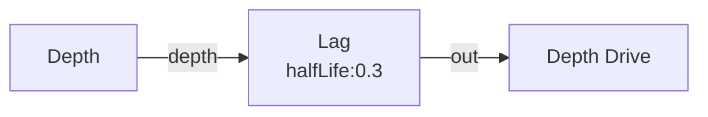

# Lag

**ID** `lag` · **Family** MOVE · **GPU** (interpreterOp)

Exponential smoothing over time. One float of state per pin.

| Param | Range | Default | Description |
|-------|-------|---------|-------------|
| `halfLife` | 0 – 5 | 0 | Half-life (seconds). 0 = passthrough |

| Port | Direction | Type |
|------|-----------|------|
| `in` | input | fieldFloat |
| `out` | output | fieldFloat |

