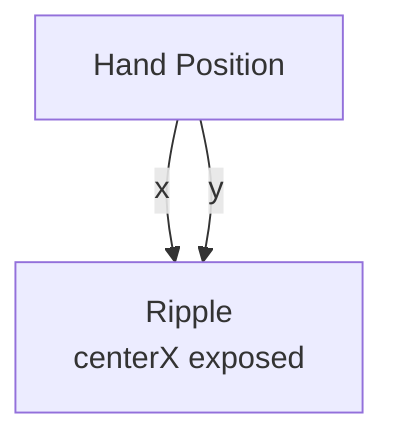

# Ripple

**ID** `radial-ripple` · **Family** MOVE · **GPU** (interpreterOp)

Analytic concentric rings from a center point. Pure math — zero state.

| Param | Range | Default | Description |
|-------|-------|---------|-------------|
| `amp` | 0 – 1 | 0 | Ripple height |
| `wavelength` | 0.02 – 1 | 0.15 | Ring spacing |
| `speed` | −4 – 4 | 0.5 | Travel speed |
| `falloff` | 0 – 8 | 2 | Radial fade |
| `centerX` | 0 – 1 | 0.5 | Center X (UV) |
| `centerY` | 0 – 1 | 0.5 | Center Y (UV) |

| Port | Direction | Type |
|------|-----------|------|
| `amplitude` | input | signal |
| `height` | output | fieldFloat |

## Trigger: Hand → Ripple Center

