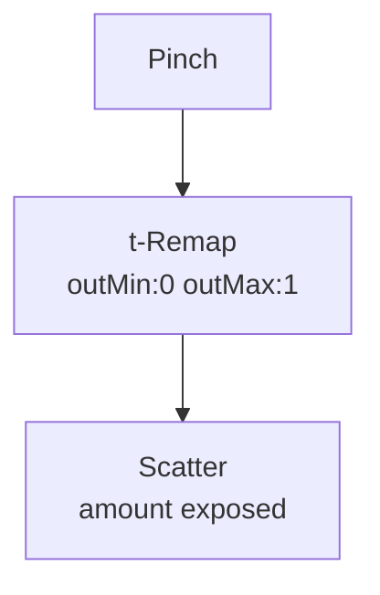

# Scatter

**ID** `scatter` · **Family** MOVE · **GPU** (interpreterOp)

Throws each pin along its seeded random direction. Amount 0 = home.

| Param | Range | Default | Description |
|-------|-------|---------|-------------|
| `amount` | 0 – 1 | 0 | Scatter strength |
| `seed` | 0 – 9999 | 3 | Random seed |

| Port | Direction | Type |
|------|-----------|------|
| `amount` | input | fieldFloat |
| `offset` | output | fieldVec3 |

## Trigger: Pinch → Scatter

