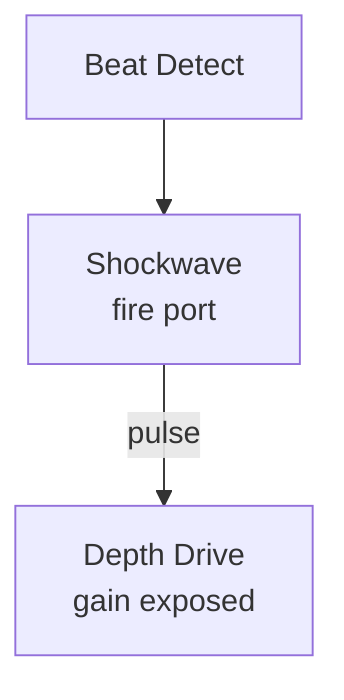

# Shockwave

**ID** `shockwave` · **Family** MOVE · **GPU** (interpreterOp)

Expanding rings fired by triggers. Up to 4 active waves.

| Param | Range | Default | Description |
|-------|-------|---------|-------------|
| `speed` | 0 – 4 | 1.2 | Expansion speed |
| `width` | 0 – 0.6 | 0.12 | Ring thickness |
| `damping` | 0 – 6 | 1.2 | Decay rate |

| Port | Direction | Type |
|------|-----------|------|
| `fire` | input | trigger |
| `pulse` | output | fieldFloat |

## Trigger: Beat → Shockwave

