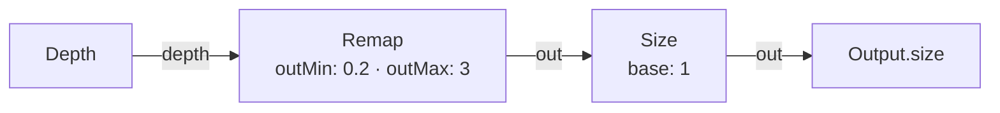
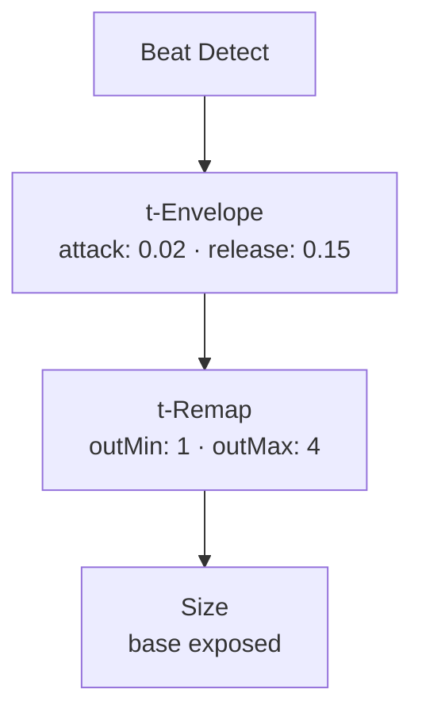
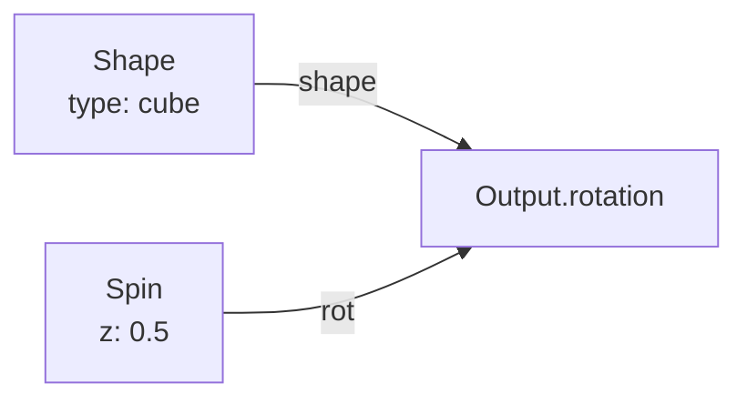
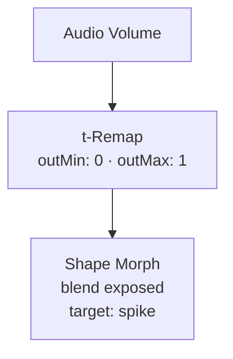
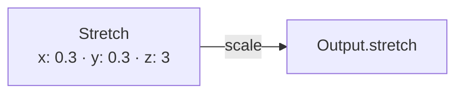
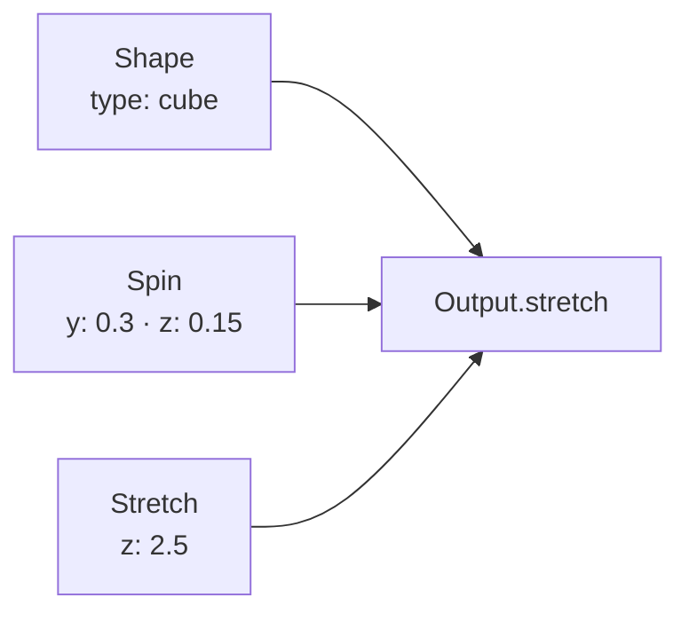
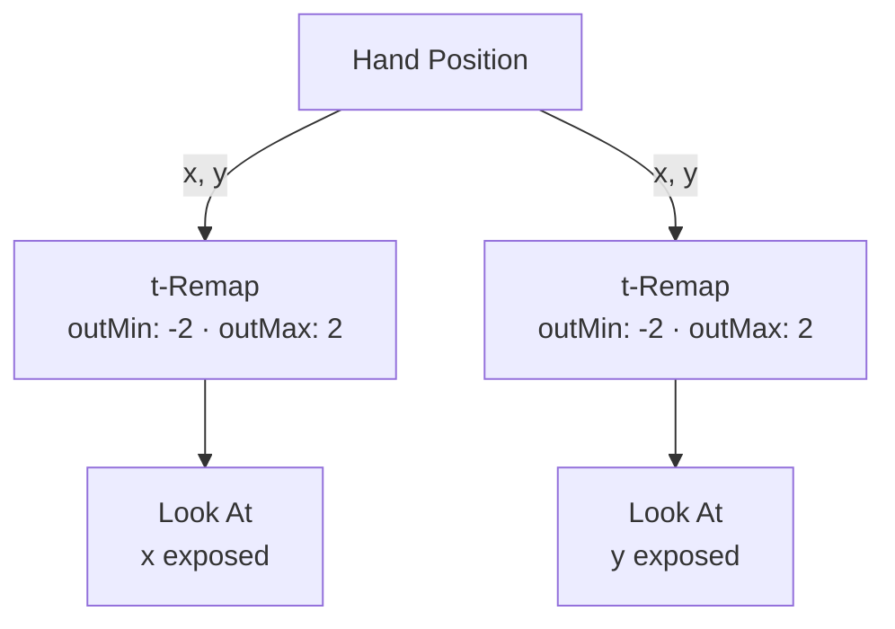
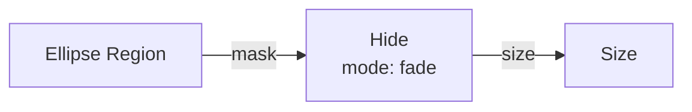

# Shape Nodes

{: .no_toc }

Shape nodes control pin geometry — size, cap shape, per-axis stretch, rotation, look-at targeting, and visibility masking. They wire into Output's shape-specific ports.

## Table of contents
{: .text-delta }
- TOC
{:toc}

---

## Size

**ID:** `size` · **Family:** shape · **Execution:** GPU (interpreterOp)

Final pin size = base × input, clamped to min/max. Size 0 hides a pin entirely.

### Parameters

| Param | Range | Default | Description |
|-------|-------|---------|-------------|
| `base` | 0–4 | 1 | Base size multiplier |
| `min` | 0–2 | 0 | Minimum size clamp |
| `max` | 0.1–6 | 3 | Maximum size clamp |

### Ports

| Port | Direction | Type | Description |
|------|-----------|------|-------------|
| `size` | input | fieldFloat | Per-pin size modulation |
| `out` | output | fieldFloat | Final clamped size |

### Example: Depth → Size

Closer objects = bigger points. A classic depth→size mapping.

### Trigger: Beat → Size Pulse

Each beat fires a quick size pulse — points explode then settle.

---

## Shape

**ID:** `shape` · **Family:** shape · **Execution:** GPU (interpreterOp)

Pin cap geometry. Changes the visual form of every point.

### Parameters

| Param | Range | Default | Description |
|-------|-------|---------|-------------|
| `type` | sphere / cube / tube / slab / cone / ring / disc / spike / diamond | sphere | Pin cap shape |

### Ports

| Port | Direction | Type | Description |
|------|-----------|------|-------------|
| `shape` | output | fieldFloat | Shape index (wire to Output.shape) |

### Shape Types

| Shape | Visual |
|-------|--------|
| **sphere** | Default round dot |
| **cube** | Flat-faced box — shows spin visibly |
| **tube** | Cylinder |
| **slab** | Flat rectangular plate |
| **cone** | Pointed cone |
| **ring** | Hollow torus ring |
| **disc** | Flat circular disc |
| **spike** | Sharp needle point |
| **diamond** | Faceted gem shape |

### Example: Shape + Spin for Visible Rotation

---

## Shape Morph

**ID:** `shape-morph` · **Family:** shape · **Execution:** GPU (interpreterOp)

Morphs from sphere toward any target shape by a blend amount.

| Param | Range | Default | Description |
|-------|-------|---------|-------------|
| `target` | cube / tube / slab / cone / ring / disc / spike / diamond | cube | Target shape |
| `blend` | 0–1 | 0 | 0 = sphere; 1 = full target shape |

### Trigger: Audio → Shape Morph

Louder = points morph from spheres into spikes.

---

## Stretch

**ID:** `stretch` · **Family:** shape · **Execution:** GPU (interpreterOp)

Per-axis pin scale — stretch points into tubes, needles, or slabs.

| Param | Range | Default | Description |
|-------|-------|---------|-------------|
| `x` | 0.1–4 | 1 | X-axis stretch |
| `y` | 0.1–4 | 1 | Y-axis stretch |
| `z` | 0.1–4 | 1 | Z-axis stretch |

### Example: Needle Cloud

---

## Rotation

**ID:** `rotation` · **Family:** shape · **Execution:** GPU (interpreterOp)

Static per-pin orientation in turns. Combine with a non-sphere Shape to see the effect.

| Param | Range | Default | Description |
|-------|-------|---------|-------------|
| `x` | −0.5–0.5 | 0 | X-axis rotation in turns |
| `y` | −0.5–0.5 | 0 | Y-axis rotation in turns |
| `z` | −0.5–0.5 | 0 | Z-axis rotation in turns |

---

## Spin

**ID:** `spin` · **Family:** shape · **Execution:** GPU (interpreterOp)

Continuous rotation from the clock — turns per second per axis.

| Param | Range | Default | Description |
|-------|-------|---------|-------------|
| `x` | −2–2 | 0 | X-axis spin rate (turns/sec) |
| `y` | −2–2 | 0 | Y-axis spin rate |
| `z` | −2–2 | 0.25 | Z-axis spin rate |

### Example: Shape + Spin + Stretch

Elongated cubes tumbling slowly — a kinetic sculpture effect.

---

## Look At

**ID:** `look-at` · **Family:** shape · **Execution:** render

Orients every pin to face a target point in space. Needs a non-sphere Shape to be visible. Like iron filings tracking a magnet.

| Param | Range | Default | Description |
|-------|-------|---------|-------------|
| `x` | −2–2 | 0 | Look target X |
| `y` | −2–2 | 0 | Look target Y |
| `z` | 0–4 | 2 | Look target Z |
| `amount` | 0–1 | 1 | Blend strength |

### Trigger: Hand Position → Look At

All points track your hand as it moves — like a field of compass needles.

---

## Stem

**ID:** `stem` · **Family:** shape · **Execution:** render

Styles the arms from the Z-wall to each pin cap. Turn ARMS on in the Depth node to see them.

| Param | Range | Default | Description |
|-------|-------|---------|-------------|
| `profile` | square / round / blade | square | Arm cross-section |
| `thickness` | 0–1 | 0.3 | Arm width |
| `taper` | 0–1 | 0.2 | Narrowing toward the cap |

---

## Material

**ID:** `material` · **Family:** shape · **Execution:** render

How pins are shaded when lit.

| Param | Range | Default | Description |
|-------|-------|---------|-------------|
| `shading` | unlit / lit / matcap | lit | Shading model |
| `roughness` | 0–1 | 0.5 | Surface roughness (low = glossy) |
| `metallic` | 0–1 | 0 | Metallic reflection amount |

---

## Hide

**ID:** `hide` · **Family:** shape · **Execution:** GPU (interpreterOp)

Shows or hides pins by a mask. Wire into Size for the final effect.

| Param | Range | Default | Description |
|-------|-------|---------|-------------|
| `mode` | fade / cutoff | fade | Fade = smooth; Cutoff = hard threshold |
| `threshold` | 0–1 | 0.5 | Cutoff threshold |
| `invert` | bool | false | Invert the mask |

### Example: Region Mask → Hide → Size

