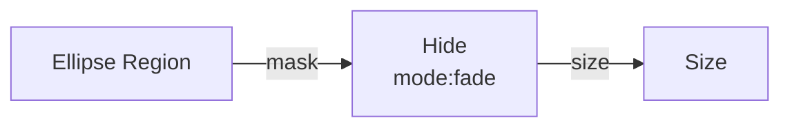

# Hide

**ID** `hide` · **Family** SHAPE · **GPU** (interpreterOp)

Shows or hides pins by a mask. Wire into Size.

## Parameters

| Param | Range | Default | Description |
|-------|-------|---------|-------------|
| `mode` | fade / cutoff | fade | Fade = smooth; Cutoff = hard |
| `threshold` | 0 – 1 | 0.5 | Cutoff point |
| `invert` | bool | false | Invert mask |

## Ports

| Port | Direction | Type | Description |
|------|-----------|------|-------------|
| `mask` | input | fieldFloat | Visibility mask |
| `size` | output | fieldFloat | Masked size |

## Standard Use: Region → Hide

