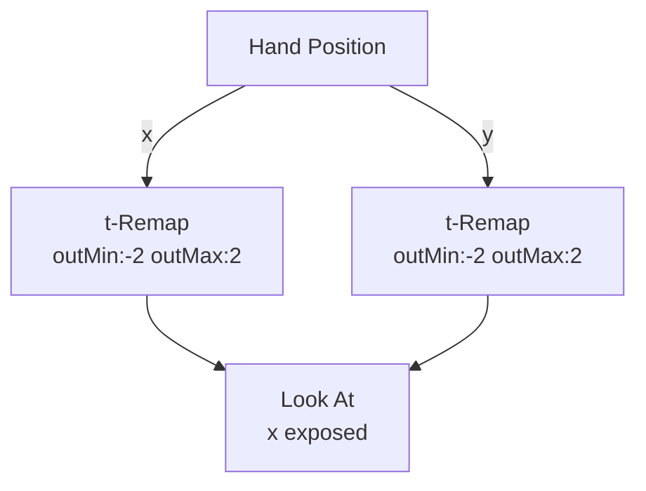

# Look At

**ID** `look-at` · **Family** SHAPE · **Render** (render-read)

Orients every pin to face a target point. Needs a non-sphere Shape to be visible.

## Parameters

| Param | Range | Default | Description |
|-------|-------|---------|-------------|
| `x` | −2 – 2 | 0 | Look target X |
| `y` | −2 – 2 | 0 | Look target Y |
| `z` | 0 – 4 | 2 | Look target Z |
| `amount` | 0 – 1 | 1 | Blend strength |

## Trigger: Hand → Look At

