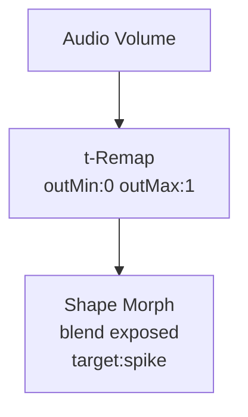

# Shape Morph

**ID** `shape-morph` · **Family** SHAPE · **GPU** (interpreterOp)

Morphs from sphere toward a target shape by blend amount.

## Parameters

| Param | Range | Default | Description |
|-------|-------|---------|-------------|
| `target` | cube / tube / slab / cone / ring / disc / spike / diamond | cube | Target shape |
| `blend` | 0 – 1 | 0 | 0 = sphere; 1 = full target |

## Ports

| Port | Direction | Type | Description |
|------|-----------|------|-------------|
| `blend` | input | fieldFloat | Morph amount |
| `shape` | output | fieldFloat | Shape index |

## Trigger: Audio → Morph

