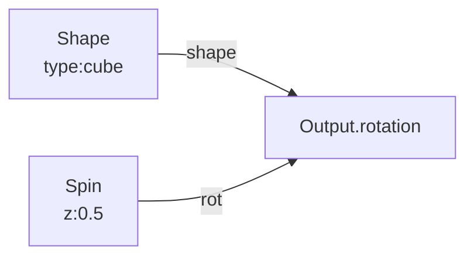

# Shape

**ID** `shape` · **Family** SHAPE · **GPU** (interpreterOp)

Pin cap geometric form. Changes the visual appearance of every point.

## Parameters

| Param | Range | Default | Description |
|-------|-------|---------|-------------|
| `type` | sphere / cube / tube / slab / cone / ring / disc / spike / diamond | sphere | Pin shape |

## Ports

| Port | Direction | Type | Description |
|------|-----------|------|-------------|
| `shape` | output | fieldFloat | Shape index (wire to Output.shape) |

## Standard Use: Shape + Spin

Use a non-sphere shape with Spin to see rotation visibly.
