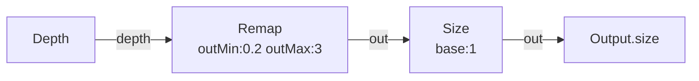
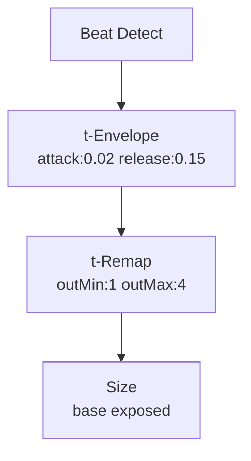

# Size

**ID** `size` · **Family** SHAPE · **GPU** (interpreterOp)

Final pin size = base × input, clamped to min/max. Size 0 hides a pin.

## Parameters

| Param | Range | Default | Description |
|-------|-------|---------|-------------|
| `base` | 0 – 4 | 1 | Base size multiplier |
| `min` | 0 – 2 | 0 | Minimum size |
| `max` | 0.1 – 6 | 3 | Maximum size |

## Ports

| Port | Direction | Type | Description |
|------|-----------|------|-------------|
| `size` | input | fieldFloat | Per-pin size |
| `out` | output | fieldFloat | Final clamped size |

## Standard Use

## Trigger: Beat → Size Pulse

