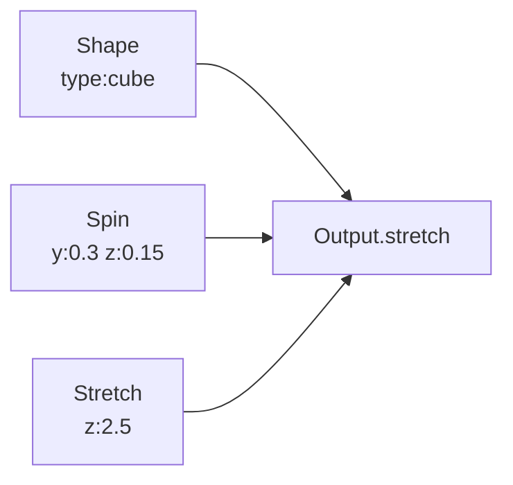

# Spin

**ID** `spin` · **Family** SHAPE · **GPU** (interpreterOp)

Continuous rotation from the clock — turns per second per axis.

## Parameters

| Param | Range | Default | Description |
|-------|-------|---------|-------------|
| `x` | −2 – 2 | 0 | X spin rate (turns/sec) |
| `y` | −2 – 2 | 0 | Y spin rate |
| `z` | −2 – 2 | 0.25 | Z spin rate |

## Ports

| Port | Direction | Type | Description |
|------|-----------|------|-------------|
| `rot` | output | fieldVec3 | Spin rotation (wire to Output.rotation) |

## Standard Use: Shape + Spin + Stretch

