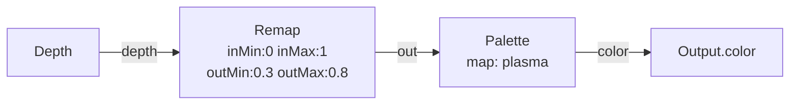
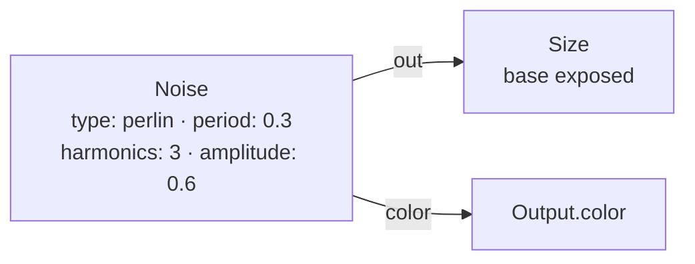
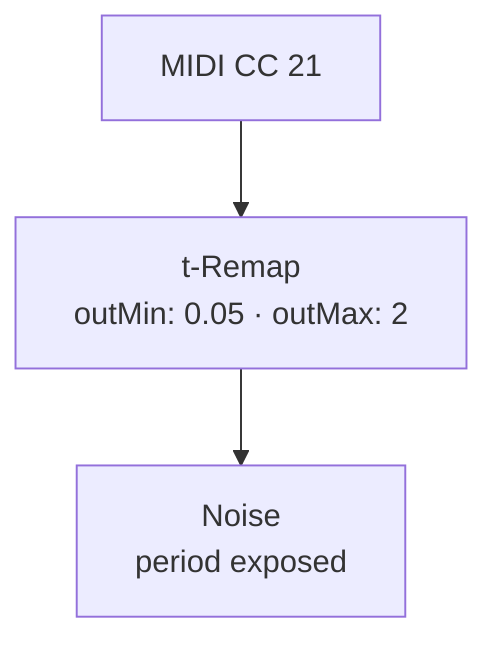
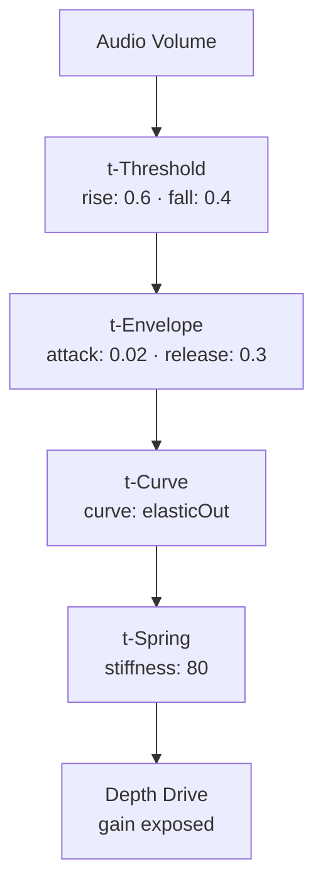

# Signal Nodes

{: .no_toc }

Signal nodes perform math, generate noise patterns, and create trigger logic. They come in two flavors: **field-rate** (GPU, per-pin) and **control-rate** (CPU, single value per frame). Control-rate nodes use a `t-` prefix convention.

## Table of contents
{: .text-delta }
- TOC
{:toc}

---

## Field-Rate Math (GPU)

These operate on every pin simultaneously in the Metal interpreter. They chain together to build complex per-pin expressions.

### Add / Subtract / Multiply / Divide

Binary operations on fieldFloat values.

| Node | ID | Op |
|------|-----|-----|
| Add | `add` | a + b |
| Subtract | `subtract` | a − b |
| Multiply | `multiply` | a × b |
| Divide | `divide` | a / b |

### Min / Max

| Node | ID | Op |
|------|-----|-----|
| Min | `min` | min(a, b) |
| Max | `max` | max(a, b) |

### Mix

**ID:** `mix` — Linear interpolation: a × (1−t) + b × t

| Param | Range | Default | Description |
|-------|-------|---------|-------------|
| `t` | 0–1 | 0.5 | Blend factor |

### Clamp

**ID:** `clamp` — Clamps input to [min, max]

| Param | Range | Default | Description |
|-------|-------|---------|-------------|
| `min` | −4–4 | 0 | Lower bound |
| `max` | −4–4 | 1 | Upper bound |

### Remap

**ID:** `remap` — Linear remap from input range to output range

| Param | Range | Default | Description |
|-------|-------|---------|-------------|
| `inMin` | −4–4 | 0 | Input range start |
| `inMax` | −4–4 | 1 | Input range end |
| `outMin` | −4–4 | 0 | Output range start |
| `outMax` | −4–4 | 1 | Output range end |

### Abs / Sine / Smoothstep / Threshold

| Node | ID | Description |
|------|-----|-------------|
| Abs | `abs` | Absolute value |
| Sine | `sine` | sin(in × freq + phase), 0–1 normalized |
| Smoothstep | `smoothstep` | Hermite interpolation between edge0 and edge1 |
| Threshold | `threshold` | Step function: 1 if in ≥ level |

### Constant

**ID:** `constant` — Outputs a fixed value to every pin.

| Param | Range | Default | Description |
|-------|-------|---------|-------------|
| `value` | −4–4 | 1 | Constant output |

### Random

**ID:** `random` — Stable per-pin random 0–1. Same every frame until reseeded.

| Param | Range | Default | Description |
|-------|-------|---------|-------------|
| `seed` | 0–9999 | 1 | Random seed |
| `contrast` | 0.25–4 | 1 | Distribution shape (>1 biases toward 0) |
| `amount` | 0–1 | 1 | Spread from 0.5 (0 = flat 0.5) |

### Example: Depth → Remap → Palette

---

## Noise

**ID:** `noise` · **Family:** signal · **Execution:** GPU (interpreterOp)

Animated 3D noise field, per pin. TouchDesigner-style noise generator with multiple types, fractal layering, and color output.

### Parameters

| Param | Range | Default | Description |
|-------|-------|---------|-------------|
| `type` | perlin / simplex / random / sparse / hermite / harmonic | perlin | Noise algorithm |
| `map` | mono + palette names | mono | Color output map (mono = greyscale) |
| `seed` | 0–9999 | 1 | Random seed |
| `period` | 0.02–4 | 0.5 | Feature size (smaller = finer grain) |
| `harmonics` | 1–6 | 3 | Fractal octaves |
| `harmonicSpread` | 1–4 | 2 | Frequency multiplier per octave |
| `harmonicGain` | 0–1 | 0.5 | Amplitude per octave |
| `roughness` | 0–1 | 0.5 | Blends toward higher-frequency energy |
| `exponent` | 0.25–4 | 1 | Power curve on output |
| `amplitude` | 0–4 | 1 | Output scale |
| `offset` | −2–2 | 0 | Output bias |
| `moveAxis` | x / y / z | z | Which axis the time drives |
| `moveRate` | −4–4 | 0.3 | Movement speed |
| `timeScale` | ms / s / min | s | Time unit |
| `moveNeg` | bool | false | Reverse movement direction |
| `aspectCorrect` | bool | true | Correct for non-square aspect ratio |

### Ports

| Port | Direction | Type | Description |
|------|-----------|------|-------------|
| `z` | input | fieldFloat | Optional Z-drive (sample plane from another field) |
| `out` | output | fieldFloat | Noise value 0–1 |
| `color` | output | fieldColor | Colored noise (mono = greyscale copies) |

### Example: Noise → Size + Color

Organic undulating surface — perlin noise drives both size and color.

### Trigger: MIDI → Noise Period

Knob sweeps noise from fine grain to broad undulation.

---

## Trigger Nodes (Control-Rate, CPU)

Trigger nodes run on the CPU at control rate (once per frame). They process signals, generate events, and shape values before they drive GPU parameters. Wire them into exposed ports.

### If / Then

**ID:** `t-if` — If COND > 0.5 pass A, else B. Core conditional logic.

### And / Or / Not / Xor

| Node | ID | Logic |
|------|-----|-------|
| And | `t-and` | 1 when A AND B both > 0.5 |
| Or | `t-or` | 1 when A OR B > 0.5 |
| Not | `t-not` | Inverts: 1 − A |
| Xor | `t-xor` | 1 when exactly one input > 0.5 |

### Threshold

**ID:** `t-threshold` — Fires when level crosses RISE; re-arms only below FALL. Schmitt trigger with cooldown.

| Param | Range | Default | Description |
|-------|-------|---------|-------------|
| `rise` | 0–1 | 0.6 | Fire threshold |
| `fall` | 0–1 | 0.4 | Re-arm threshold (must be < rise) |
| `cooldown` | 0–2 | 0.08 | Minimum time between fires in seconds |

### Envelope

**ID:** `t-envelope` — Trigger → smooth 0–1. Rises while trigger is held, falls when released.

| Param | Range | Default | Description |
|-------|-------|---------|-------------|
| `attack` | 0.001–3 | 0.05 | Rise time in seconds |
| `release` | 0.005–6 | 0.35 | Fall time in seconds |

### Curve

**ID:** `t-curve` — Reshapes a 0–1 value through an easing curve.

| Curve | Description |
|-------|-------------|
| `quadIn/Out/InOut` | Quadratic easing |
| `cubicIn/Out/InOut` | Cubic easing |
| `backIn/Out/InOut` | Overshooting back easing |
| `bounceOut` | Bouncing settle |
| `elasticOut` | Springy overshoot |

### Spring

**ID:** `t-spring` — Physical follow toward target with overshoot/settle.

| Param | Range | Default | Description |
|-------|-------|---------|-------------|
| `stiffness` | 1–300 | 120 | Spring constant |
| `damping` | 1–40 | 18 | Damping |

### Add / Multiply / Remap (Control-Rate)

| Node | ID | Description |
|------|-----|-------------|
| Add | `t-add` | A + B |
| Multiply | `t-multiply` | A × B |
| Remap | `t-remap` | Linear remap in→out range |

### Example: Complex Trigger Chain

Audio volume → threshold → envelope → elastic curve → spring physics → depth gain. Ludicrously organic motion.
