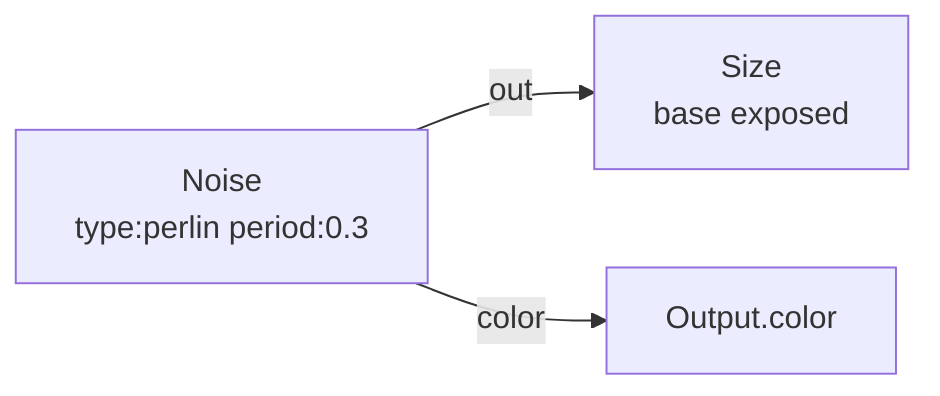
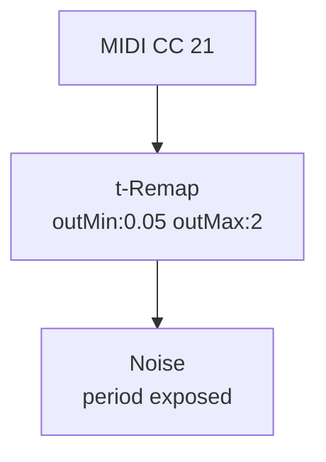

# Noise

**ID** `noise` · **Family** SIGNAL · **GPU** (interpreterOp)

Animated 3D noise field per pin. Multiple types, fractal layering, and color output.

| Param | Range | Default | Description |
|-------|-------|---------|-------------|
| `type` | perlin / simplex / random / sparse / hermite / harmonic | perlin | Noise algorithm |
| `map` | mono + palette names | mono | Color output map |
| `seed` | 0 – 9999 | 1 | Random seed |
| `period` | 0.02 – 4 | 0.5 | Feature size |
| `harmonics` | 1 – 6 | 3 | Fractal octaves |
| `harmonicSpread` | 1 – 4 | 2 | Freq per octave |
| `harmonicGain` | 0 – 1 | 0.5 | Amp per octave |
| `roughness` | 0 – 1 | 0.5 | High-freq energy |
| `exponent` | 0.25 – 4 | 1 | Power curve |
| `amplitude` | 0 – 4 | 1 | Output scale |
| `offset` | −2 – 2 | 0 | Output bias |
| `moveAxis` | x / y / z | z | Time axis |
| `moveRate` | −4 – 4 | 0.3 | Speed |
| `aspectCorrect` | bool | true | Square correction |

| Port | Direction | Type |
|------|-----------|------|
| `z` | input | fieldFloat |
| `out` | output | fieldFloat |
| `color` | output | fieldColor |

## Trigger: MIDI → Period

