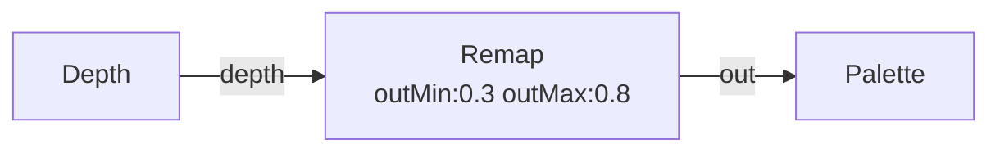

# Remap

**ID** `remap` · **Family** SIGNAL · **GPU** (interpreterOp)

Linear remap from input range to output range.

| Param | Range | Default | Description |
|-------|-------|---------|-------------|
| `inMin` | −4 – 4 | 0 | Input range start |
| `inMax` | −4 – 4 | 1 | Input range end |
| `outMin` | −4 – 4 | 0 | Output range start |
| `outMax` | −4 – 4 | 1 | Output range end |

| Port | Direction | Type |
|------|-----------|------|
| `in` | input | fieldFloat |
| `out` | output | fieldFloat |

