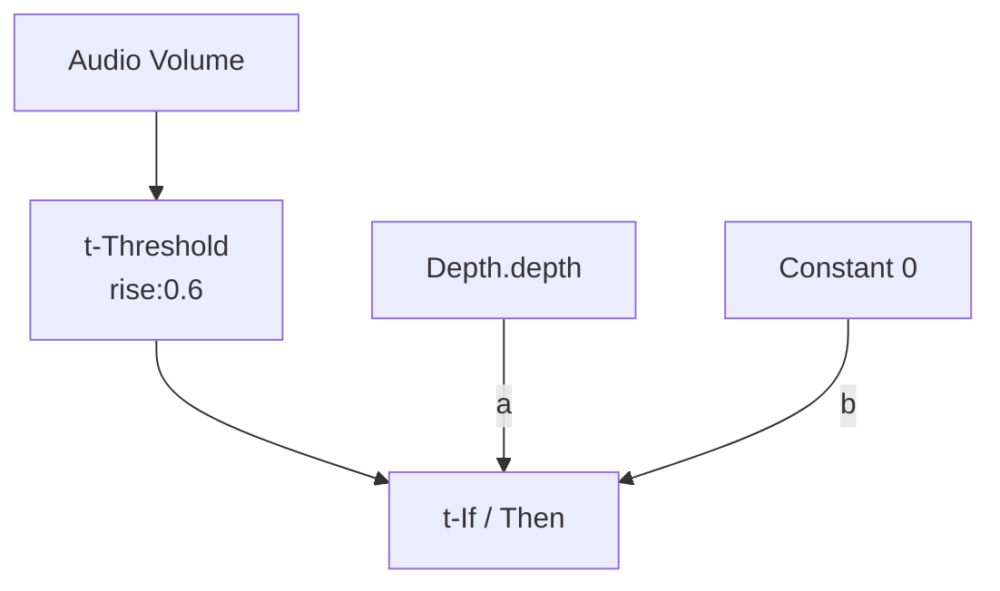

# If / Then

**ID** `t-if` · **Family** SIGNAL · **CPU** (control)

If COND > 0.5 pass A, else B. Core conditional logic.

| Port | Direction | Type |
|------|-----------|------|
| `cond` | input | signal |
| `a` | input | signal |
| `b` | input | signal |
| `out` | output | signal |

