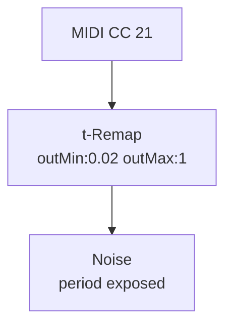

# Remap (CPU)

**ID** `t-remap` · **Family** SIGNAL · **CPU** (control)

Linear remap in→out range. Use to scale any 0–1 input to a target parameter's range.

| Param | Range | Default | Description |
|-------|-------|---------|-------------|
| `inMin` | −4 – 4 | 0 | Input range start |
| `inMax` | −4 – 4 | 1 | Input range end |
| `outMin` | −4 – 4 | 0 | Output range start |
| `outMax` | −4 – 4 | 1 | Output range end |

| Port | Direction | Type |
|------|-----------|------|
| `in` | input | signal |
| `out` | output | signal |

