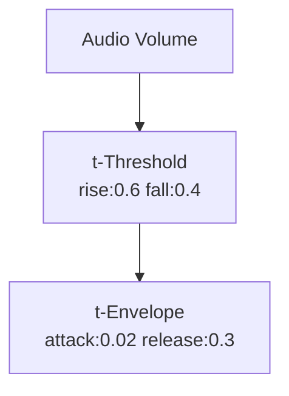

# Threshold (Trigger)

**ID** `t-threshold` · **Family** SIGNAL · **CPU** (control)

Schmitt trigger: fires when level crosses RISE; re-arms below FALL.

| Param | Range | Default | Description |
|-------|-------|---------|-------------|
| `rise` | 0 – 1 | 0.6 | Fire threshold |
| `fall` | 0 – 1 | 0.4 | Re-arm threshold |
| `cooldown` | 0 – 2 | 0.08 | Min time between fires |

| Port | Direction | Type |
|------|-----------|------|
| `level` | input | signal |
| `fired` | output | trigger |

