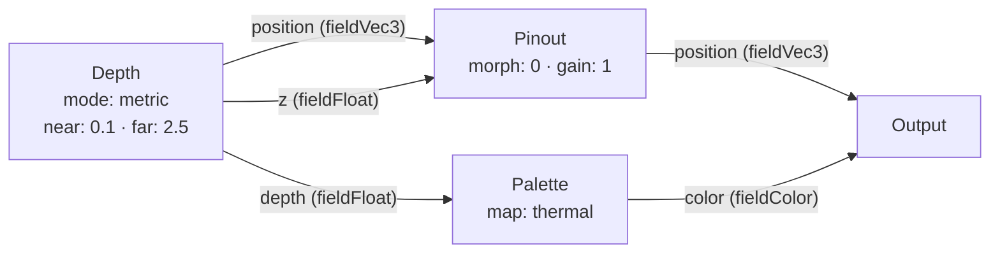
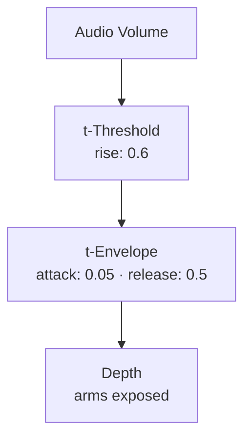
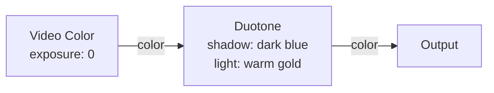
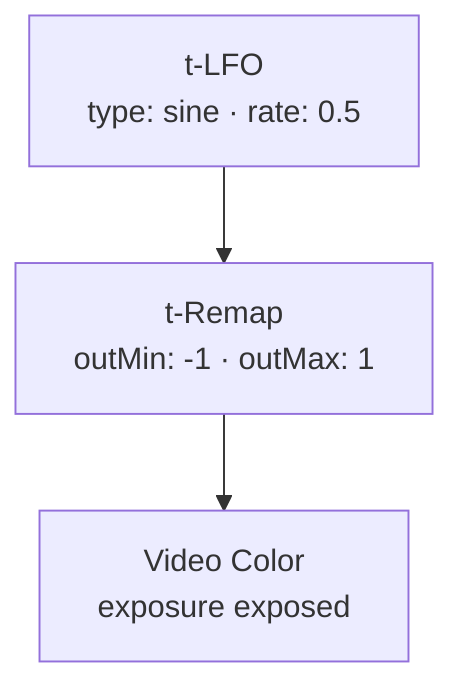
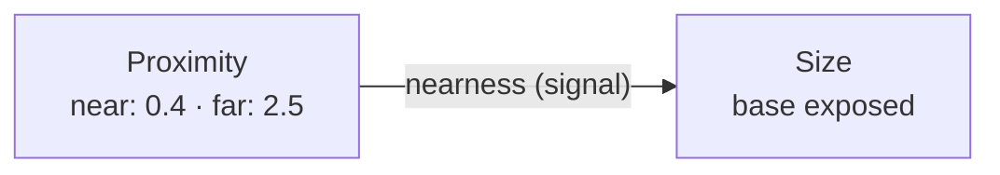
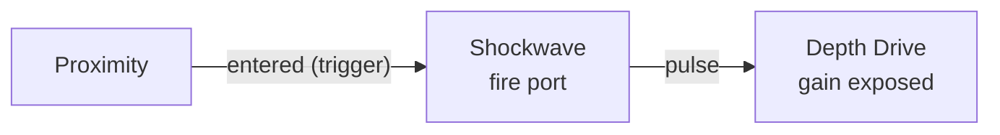

# Source Nodes

{: .no_toc }

Source nodes are where data enters the graph — they read from sensors, cameras, and imported media. They have no inputs and produce field-rate outputs (per-pin values computed on the GPU).

## Table of contents
{: .text-delta }
- TOC
{:toc}

---

## Depth

**ID:** `depth` · **Family:** source · **Execution:** GPU (interpreterOp)

The primary sensor node. Reads the depth camera and produces per-pin nearness (0–1), 3D position offset, and Z push. Three output modes: METRIC uses real camera intrinsics for true-scale unprojection; FREE uses the intrinsic-free fan projection.

### Parameters

| Param | Range | Default | Description |
|-------|-------|---------|-------------|
| `near` | 0.05–5 | 0.1 | Closest readable depth in metres |
| `far` | 0.2–8 | 2.5 | Farthest readable depth in metres |
| `invert` | bool | false | Flip nearness: far→1, near→0 |
| `mode` | free / metric | metric | METRIC = real camera intrinsics (true size); FREE = intrinsic-free fan |
| `separation` | 0–4 | 2.5 | Metres→view scale conversion |
| `focus` | 0.3–3 | 1.0 | Depth that sits exactly at the wall |
| `gain` | 0–3 | 2.5 | Z zoom strength (FREE mode) |
| `arms` | bool | false | Pull every point back to its Z-origin pin (rod effect) |
| `edgeCull` | 0–0.3 | 0.06 | Built-in silhouette flying-pixel reject in metres |

### Ports

| Port | Direction | Type | Description |
|------|-----------|------|-------------|
| `depth` | output | fieldFloat | Nearness 0–1 (near→far → 1→0) |
| `position` | output | fieldVec3 | Per-pin 3D offset from home |
| `z` | output | fieldFloat | Z push amount for pin-screen relief |

### Example: Depth → Pinout → Output

### Trigger Modulation: Audio-Driven Arms

When audio crosses the threshold, arms snap on for 0.5s — rods pulse with the beat.

---

## Video Color

**ID:** `video-color` · **Family:** source · **Execution:** GPU (interpreterOp)

Samples the camera's RGB image at each pin's UV coordinate. Produces per-pin color that you can route through color transforms.

### Parameters

| Param | Range | Default | Description |
|-------|-------|---------|-------------|
| `exposure` | −2–2 | 0 | Exposure adjustment in stops (2^exposure multiplier) |

### Ports

| Port | Direction | Type | Description |
|------|-----------|------|-------------|
| `color` | output | fieldColor | Camera color sampled at each pin |

### Example: Video Color → Duotone

### Trigger Modulation: Exposure Sweep

A slow sine LFO sweeps exposure from −1 to +1 stops for a breathing brightness effect.

---

## Source

**ID:** `source` · **Family:** source · **Execution:** CPU (control)

The top-level input selector. Picks which camera/sensor feeds the graph.

### Parameters

| Param | Range | Default | Description |
|-------|-------|---------|-------------|
| `mode` | auto / trueDepth / lidar / media / still | auto | Which source to use |
| `mirror` | bool | true | Mirror front camera |

---

## Vision Model

**ID:** `vision-model` · **Family:** source · **Execution:** GPU (interpreterOp)

Imports a photo or video and bakes depth on-device using MoGe-2. The resulting point cloud behaves identically to the Depth node. Tap the image/video button to pick from your gallery.

### Parameters

| Param | Range | Default | Description |
|-------|-------|---------|-------------|
| `near` | 0.05–5 | 0.1 | Closest depth in metres |
| `far` | 0.2–8 | 2.5 | Farthest depth in metres |
| `invert` | bool | false | Flip nearness |
| `mode` | free / metric | metric | Unprojection mode |
| `separation` | 0–4 | 2.5 | Metres→view scale |
| `focus` | 0.3–3 | 1.0 | Wall depth |
| `gain` | 0–3 | 2.5 | Z zoom (FREE mode) |
| `media` | bool | false | Set by the picker button; X clears it |

### Ports

| Port | Direction | Type | Description |
|------|-----------|------|-------------|
| `depth` | output | fieldFloat | Estimated nearness 0–1 |
| `position` | output | fieldVec3 | 3D offset from home |
| `z` | output | fieldFloat | Z push amount |

---

## Confidence

**ID:** `confidence` · **Family:** source · **Execution:** GPU (interpreterOp)

Per-pin sensor confidence 0–1. Noisy edges score low. Reads 1.0 until the confidence texture is bound.

### Parameters

| Param | Range | Default | Description |
|-------|-------|---------|-------------|
| `floor` | 0–1 | 0 | Values below this are clamped to 0 |

---

## Proximity

**ID:** `proximity` · **Family:** source · **Execution:** CPU (control)

How close the nearest subject is, live from the depth sensor.

### Parameters

| Param | Range | Default | Description |
|-------|-------|---------|-------------|
| `near` | 0.15–2 | 0.4 | Distance for nearness=1 |
| `far` | 0.5–6 | 2.5 | Distance for nearness=0 |
| `threshold` | 0–1 | 0.5 | Trigger fires when nearness crosses this |

### Ports

| Port | Direction | Type | Description |
|------|-----------|------|-------------|
| `nearness` | output | signal | 1 at NEAR metres → 0 at FAR metres |
| `entered` | output | trigger | Pulses once when nearness crosses threshold upward |

### Example: Proximity → Size Swell

As someone walks toward the camera, points swell up.

### Trigger: Proximity → Shockwave

