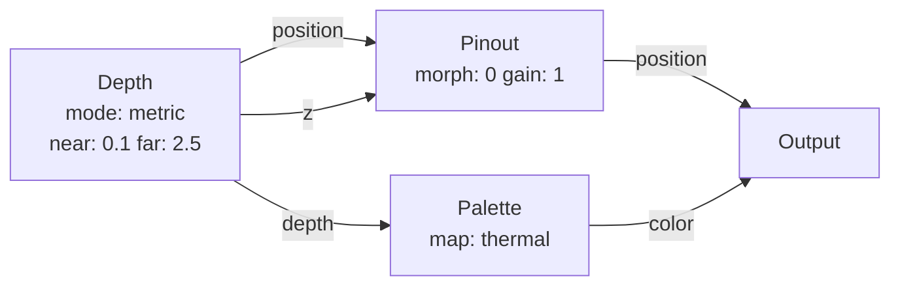
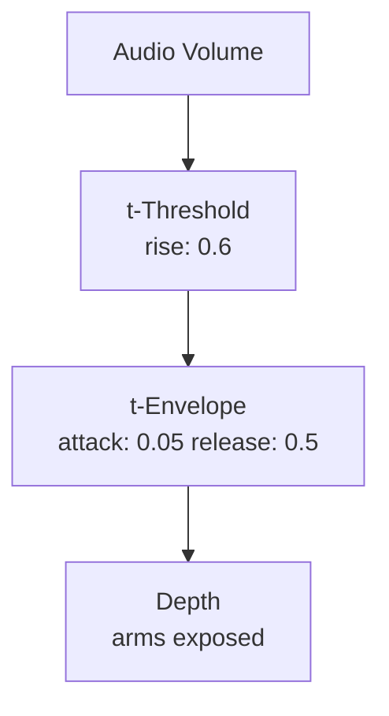

# Depth

**ID** `depth` · **Family** SOURCE · **GPU** (interpreterOp)

The primary sensor node. Reads the depth camera and produces per-pin nearness, 3D position offset, and Z push. METRIC mode uses real camera intrinsics for true-scale unprojection. FREE mode uses the intrinsic-free fan projection.

## Parameters

| Param | Range | Default | Description |
|-------|-------|---------|-------------|
| `near` | 0.05 – 5 | 0.1 | Closest readable depth (metres) |
| `far` | 0.2 – 8 | 2.5 | Farthest readable depth (metres) |
| `invert` | bool | false | Flip nearness: far→1, near→0 |
| `mode` | free / metric | metric | METRIC = real camera intrinsics; FREE = intrinsic-free fan |
| `separation` | 0 – 4 | 2.5 | Metres→view scale conversion |
| `focus` | 0.3 – 3 | 1.0 | Depth that sits at the Z-wall |
| `gain` | 0 – 3 | 2.5 | Z zoom strength (FREE mode) |
| `arms` | bool | false | Pull points back to Z-origin pins (rod effect) |
| `edgeCull` | 0 – 0.3 | 0.06 | Silhouette flying-pixel reject (metres) |

## Ports

| Port | Direction | Type | Description |
|------|-----------|------|-------------|
| `depth` | output | fieldFloat | Nearness 0→1 = near→far |
| `position` | output | fieldVec3 | Per-pin 3D offset from grid home |
| `z` | output | fieldFloat | Z push amount |

## Standard Use: Depth → Pinout → Output

## Trigger Modulation: Audio → Arms

Audio above threshold snaps arms on for 0.5s — rods pulse with the beat.
