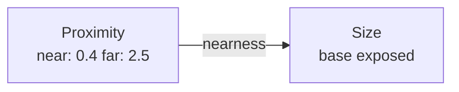
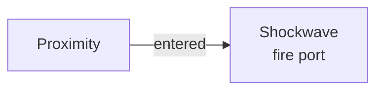

# Proximity

**ID** `proximity` · **Family** SOURCE · **CPU** (control)

How close the nearest subject is, live from the depth sensor. Produces a nearness signal and an enter/exit trigger.

## Parameters

| Param | Range | Default | Description |
|-------|-------|---------|-------------|
| `near` | 0.15 – 2 | 0.4 | Distance for nearness=1 |
| `far` | 0.5 – 6 | 2.5 | Distance for nearness=0 |
| `threshold` | 0 – 1 | 0.5 | Trigger crossing point |

## Ports

| Port | Direction | Type | Description |
|------|-----------|------|-------------|
| `nearness` | output | signal | 1 at NEAR → 0 at FAR |
| `entered` | output | trigger | Pulses when nearness crosses threshold |

## Standard Use: Proximity → Size

As someone walks toward the camera, points swell.

## Trigger Use: Entered → Shockwave

