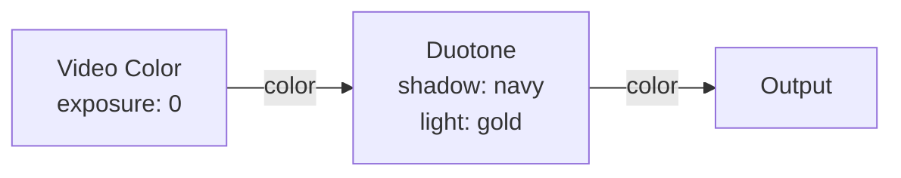
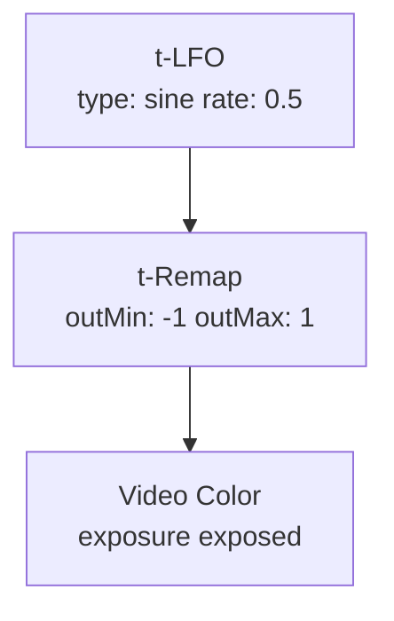

# Video Color

**ID** `video-color` · **Family** SOURCE · **GPU** (interpreterOp)

Samples the RGB camera image at each pin's UV coordinate. Produces per-pin color for routing through color transforms.

## Parameters

| Param | Range | Default | Description |
|-------|-------|---------|-------------|
| `exposure` | −2 – 2 | 0 | Exposure in stops (2^exposure multiplier) |

## Ports

| Port | Direction | Type | Description |
|------|-----------|------|-------------|
| `color` | output | fieldColor | Camera color at each pin |

## Standard Use: Video Color → Duotone

## Trigger Modulation: LFO → Exposure Sweep

Slow sine sweeps exposure from −1 to +1 stops — breathing brightness.
