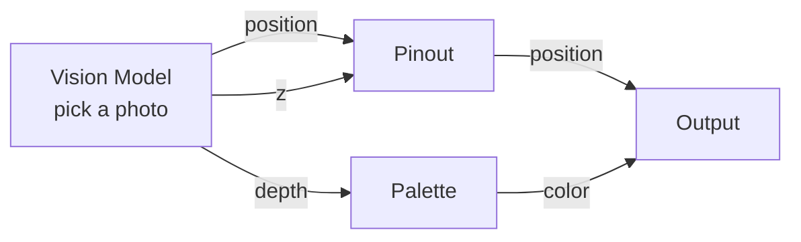

# Vision Model

**ID** `vision-model` · **Family** SOURCE · **GPU** (interpreterOp)

Imports a photo or video and bakes depth on-device using MoGe-2. The point cloud behaves identically to the Depth node. Tap the image/video button to pick from your gallery.

## Parameters

| Param | Range | Default | Description |
|-------|-------|---------|-------------|
| `near` | 0.05 – 5 | 0.1 | Closest depth (metres) |
| `far` | 0.2 – 8 | 2.5 | Farthest depth (metres) |
| `invert` | bool | false | Flip nearness |
| `mode` | free / metric | metric | Unprojection mode |
| `separation` | 0 – 4 | 2.5 | Metres→view scale |
| `focus` | 0.3 – 3 | 1.0 | Wall depth |
| `gain` | 0 – 3 | 2.5 | Z zoom (FREE mode) |
| `media` | bool | false | Set by picker; X clears |

## Ports

| Port | Direction | Type | Description |
|------|-----------|------|-------------|
| `depth` | output | fieldFloat | Estimated nearness |
| `position` | output | fieldVec3 | 3D offset from home |
| `z` | output | fieldFloat | Z push |

## Standard Use: Photo → Point Cloud

