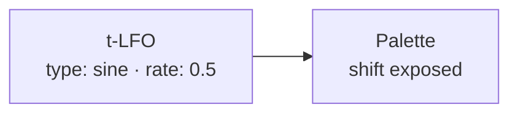
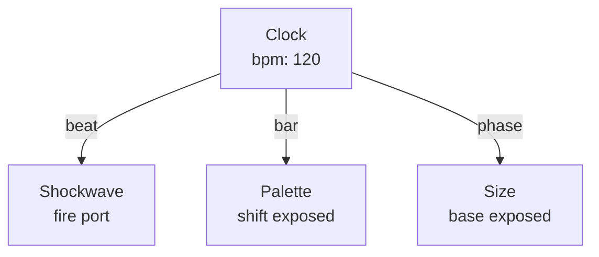

# Time & Stage Nodes

{: .no_toc }

Time nodes generate clocks and LFOs. Stage nodes control the render environment — camera, lighting, background.

## Table of contents
{: .text-delta }
- TOC
{:toc}

---

## LFO

**ID:** `lfo` · **Family:** time · **Execution:** CPU (control)

Low-frequency oscillator with multiple waveforms and BPM sync.

### Parameters

| Param | Range | Default | Description |
|-------|-------|---------|-------------|
| `type` | sine / triangle / saw / square / random | sine | Waveform |
| `rate` | 0.01–20 | 1 | Frequency in Hz (or BPM division) |
| `phase` | 0–1 | 0 | Phase offset |
| `sync` | free / bpm | free | Free-running or BPM-locked |

### Example: LFO → Palette Shift

A slow sine wave sweeps the palette back and forth.

---

## Clock

**ID:** `clock` · **Family:** time · **Execution:** CPU (control)

Global clock with BPM, beat count, and phase output. All time-synced nodes reference this.

### Ports

| Port | Direction | Type | Description |
|------|-----------|------|-------------|
| `beat` | output | trigger | Pulses on each beat |
| `bar` | output | trigger | Pulses on each bar |
| `phase` | output | signal | Beat phase 0–1 |
| `bpm` | output | signal | Current BPM |

### Example: Clock → Synced Effects

---

## Camera

**ID:** `camera` · **Family:** stage · **Execution:** render

Controls the viewport camera — field of view, zoom, parallax, orbit.

### Parameters

| Param | Range | Default | Description |
|-------|-------|---------|-------------|
| `fov` | 10–120 | 55 | Field of view in degrees |
| `zoom` | 0.1–4 | 1 | Zoom level |
| `parallax` | 0–1 | 0.5 | Perspective strength |
| `depthPush` | 0–3 | 1 | World-space Z exaggeration |
| `centerX` | −1–1 | 0 | Pivot offset X |
| `centerY` | −1–1 | 0 | Pivot offset Y |
| `orbitX` | −π–π | 0 | Yaw around pivot |
| `orbitY` | −π–π | 0 | Pitch around pivot |
| `dolly` | −1–1 | 0 | Eye distance (−1 further, +1 closer) |

---

## Light

**ID:** `light` · **Family:** stage · **Execution:** render

Point, directional, or spot light. Up to 4 lights active at once. Requires Material shading mode set to "lit."

### Parameters

| Param | Range | Default | Description |
|-------|-------|---------|-------------|
| `type` | point / directional / spot | point | Light type |
| `intensity` | 0–5 | 1 | Brightness |
| `falloff` | 0–10 | 2 | Distance falloff (point/spot) |
| `x/y/z` | −3–3 | 0 / 0 / 3 | Position (point/spot) or direction (directional) |
| `enabled` | bool | true | Toggle |

---

## Background

**ID:** `background` · **Family:** stage · **Execution:** render

Sets the background color and gradient. The viewport background behind the point cloud.

| Param | Range | Default | Description |
|-------|-------|---------|-------------|
| `r/g/b` | 0–1 | 0 / 0 / 0 | Background color |
| `gradient` | 0–1 | 0 | Vertical gradient amount |

---

## Render Settings

**ID:** `render-settings` · **Family:** stage · **Execution:** render

Global render toggles.

| Param | Range | Default | Description |
|-------|-------|---------|-------------|
| `ghost` | bool | false | Additive ghost blending mode |
| `pointCount` | 1000–200000 | 30000 | Number of active pins |
| `pinSize` | 0.001–0.1 | 0.012 | Default pin size |

### Post-Processing

| Param | Range | Default | Description |
|-------|-------|---------|-------------|
| `bloom` | bool | false | Bloom glow effect |
| `bloomIntensity` | 0–3 | 1 | Bloom brightness |
| `bloomRadius` | 0–20 | 6 | Bloom spread in pixels |
| `vignette` | 0–1 | 0 | Edge darkening |
| `grain` | 0–1 | 0 | Film grain amount |

---

## Orbit Cube

**ID:** `orbit-cube` · **Family:** stage · **Execution:** render

Draws a gizmo cube at the orbit pivot point. Visual feedback for the Camera's orbitX/orbitY controls.

---

## Depth Bands

**ID:** `depth-bands` · **Family:** grid · **Execution:** GPU (interpreterOp)

Quantizes a depth field into hard terraced steps — topographic contour bands.

| Param | Range | Default | Description |
|-------|-------|---------|-------------|
| `bands` | 2–20 | 6 | Number of terrace levels |

---

## Depth Rings

**ID:** `depth-rings` · **Family:** grid · **Execution:** GPU (interpreterOp)

Sinusoidal contour lines rippling through depth. Wire to Size or a color for topographic lines.

| Param | Range | Default | Description |
|-------|-------|---------|-------------|
| `frequency` | 1–60 | 18 | Ring density |
| `sharpness` | 1–8 | 2 | Ring edge sharpness |
