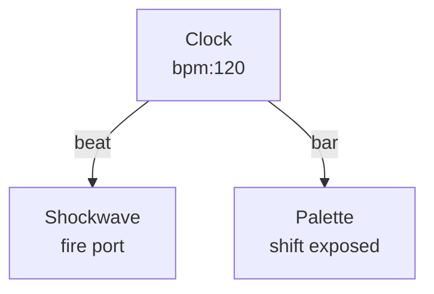

# Clock

**ID** `clock` · **Family** TIME · **CPU** (control)

Global clock with BPM, beat count, and phase.

| Port | Direction | Type |
|------|-----------|------|
| `beat` | output | trigger |
| `bar` | output | trigger |
| `phase` | output | signal |
| `bpm` | output | signal |

