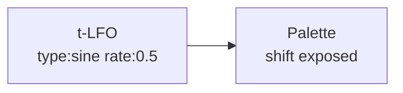

# LFO

**ID** `lfo` · **Family** TIME · **CPU** (control)

Low-frequency oscillator with BPM sync.

| Param | Range | Default | Description |
|-------|-------|---------|-------------|
| `type` | sine / triangle / saw / square / random | sine | Waveform |
| `rate` | 0.01 – 20 | 1 | Frequency (Hz or BPM div) |
| `phase` | 0 – 1 | 0 | Phase offset |
| `sync` | free / bpm | free | Clock sync |

| Port | Direction | Type |
|------|-----------|------|
| `out` | output | signal |

